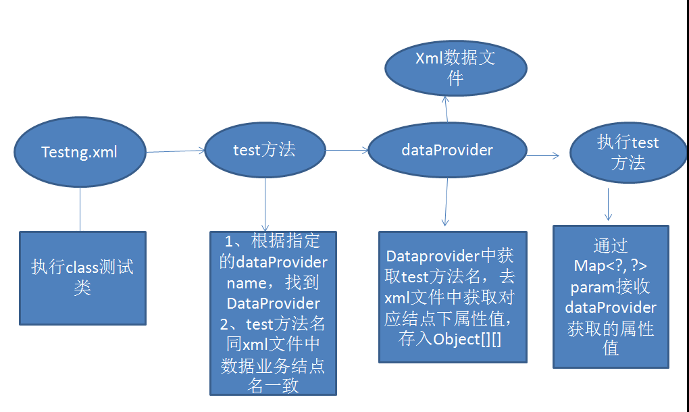
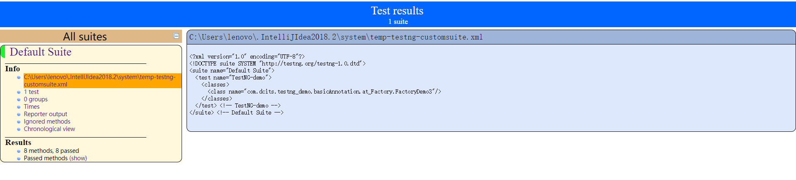
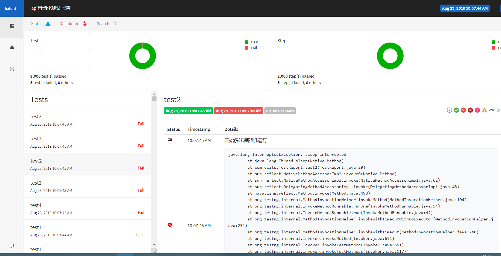
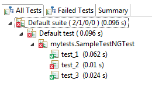

# TestNG使用指南

[TOC]


## 一、简述

### 1.自动化测试

#### 1)什么是自动化测试框架

一般是指**软件测试的自动化**，软件测试就是在预设条件下**运行系统或应用程序**，**评估**运行**结果**，预先条件应包括正常条件和异常条件。

自动化测试是把以人为驱动的测试行为转化为机器执行的一种过程。通常，在设计了测试用例并通过评审之后，由测试人员根据测试用例中描述的规程一步步执行测试，得到实际结果与期望结果的比较。在此过程中，为了节省人力、时间或硬件资源，提高测试效率，便引入了自动化测试的概念。（From 百度百科）


#### 2).为什么需要自动化测试

①、黑盒测试回归效率低

②、手动测试的偶然性和不确定性

③、回归的覆盖率不足

④、交付的产品质量无法保证，全靠评估

⑤、系统越复杂，问题越多

⑥、上线时间长、构件失败率高导致的蝴蝶效应。

简而言之，自动化测试代替手工测试，可以减少因为手工测试导致的偶然错误，可以调高测试效率，可以提高测试覆盖率。


#### 3).自动化测试能解决什么样的问题

①、提高出现问题后的响应速率

②、降低回归成本

③、提高回归覆盖率

④、提高回归效率

⑤、提高回归的稳定性

自动化测试目前并不代表智能测试，并不能帮助我们自主地找出BUG，主要是提高我们在发现BUG之后定位效率以及回归测试的稳定性。

自动化测试主要目的，还是在于取代手工测试中一些重复的工作，例如：回归测试需要将之前的测试用例全部重新测试，自动化测试可以自动完成；测试中，需要编写测试报告，自动化测试可以在测试完成之后自动生成指定的测试报告；在测试中，测试用例不断增加，手工测试对于测试用例管理难度会不断增加，自动化测试可以帮助我们记忆测试用例以及拓展测试用例。

自动化测试并非完全只是代替机械重复的工作，而是可以在基于一定的基础，例如Junit，进行封装，完成一些相对简单的工作，减少测试的工作量。例如，自动扫描工程文件，生成相应结构的单元测试函数；通过制定约束条件，自动生成测试用例；通过简单的配置文件，对相对复杂的流程进行测试。


#### 4).自动化测试的局限性

①、无法减少成本投入。

②、无法完全通用。

总体而言，自动化测试框架构建相对复杂，构建一个自动化测试化框架需要付出较大的时间、人力、物力成本。构建的自动化测试框架不一定具有通用性，具有通用性的框架难以具备指定的功能。但是，一个好的自动化测试框架，能够帮助我们节省大量时间，无论是测试用例的编写、还是测试用例的管理亦或是测试用例的编排，以及测试报告的生成，一个自动化测试框架都应该能够帮助或辅助我们快速完成。


#### 5).自动化测试框架所具备的功能

> Log：日志记录和管理功能，针对不同的情况，设置不同的日志级别，方便定位问题；
>
> Report：测试报告生成和管理以及即时通知，测试结果快速响应；
>
> Source：配置文件、静态资源的管理，遵循高内聚低耦合原则；
>
> Common：公共函数、方法以及通用操作的管理，遵循高内聚低耦合原则；
>
> TestCase：测试用例管理功能，一个功能点对应一个或者多个case，尽可能的提高覆盖率；
>
> TestData：测试数据管理功能，数据与脚本分离，降低维护成本，提高可移植性；
>
> TestSuite：测试组件管理功能，针对不同场景不同需求，组装构建不同的测试框架，遵循框架的灵活性和扩展性；
>
> Statistics：测试结果统计管理功能，每次执行测试的结果统计、分析、对比以及反馈，数据驱动，为软件优化和流程改进，提供参考；
>
> Continuous：持续集成环境，即CI环境，包括测试文件提交、扫描编译、执行测试、生成报告及时通知等功能，持续集成是自动化测试的核心！

### 2.TestNG

> TestNG是由CédricBeust创建的Java编程语言的测试框架，受JUnit和NUnit的启发。 TestNG的设计目标是涵盖更广泛的测试类别：单元，功能，端到端，集成等，具有更强大和易用的功能。


### 3.框架对比

#### 1).JUnit & TestNG

- 相同点

  都是java测试工具，都是基于注释的且大部分注释相似，它们都可以进行单元测试。

- JUnit和TestNG的不同点

  - 基本注释对比

    | 特点                                 | TestNG                       | JUnit              |
    | ------------------------------------ | ---------------------------- | ------------------ |
    | 测试注释                             | @Test                        | @Test              |
    | 在套件中所有测试用例运行之前         | @BeforeSuit                  | -                  |
    | 在套件中所有测试用例运行之后         | @AfterSuit                   | -                  |
    | 测试运行之前                         | @BeforeTest                  | -                  |
    | 测试运行之前                         | @AfterTest                   | -                  |
    | 在调用任何属于这个组的方法之前运行   | @BeforeGroups                | -                  |
    | 在调用任何属于这个组的方法之后运行   | @AfterGroups                 | -                  |
    | 在调用当前类的第一个测试方法之前运行 | @BeforeClass                 | @BeforeClass       |
    | 在调用当前类的第一个测试方法之后运行 | @AfterClass                  | @AfterClass        |
    | 在每个测试方法之前运行               | @BeforeMethod                | @Before            |
    | 在每个测试方法之后运行               | @AfterMethod                 | @After             |
    | 忽略测试                             | @Test(enable = )             | @ignore            |
    | 预期异常测试                         | @Test(exceptedExceptions = ) | @Test(excepted = ) |
    | 超时测试                             | @Test(exceptedExceptions = ) | @Test(timeout=)    |
    | 监听器                               | @Listener                    | -                  |

    1. 从上述标签可以看出，JUnit能做的，TestNG皆可以。JUnit做不到的，TestNG也能做到。
    2. 在JUnit 中，我们必须声明@BeforeClass和@AfterClass方法作为静态方法，TestNG没有这个约束。也就是说，TestNG的@Before* & @After*方法内部不需要是静态成员，也可以调用非静态的成员和函数，大大减少了对于方法的约束，使用自然也就更加方便，应用范围更加广泛。
    3. TestNG的Test标签属性更为丰富，能够实现的功能更多。例如：并行、失败重测等。

  - 套件测试

    - JUnit

      运用“@RunWith”和“@Suite”注释运行套件测试，测试套件运行失败时，JUnit 4会标记为全部失败，之后重新运行整个测试套件。

    - TestNG

      用XML文件运行套件测试，TestNG不仅可以做捆绑类测试，也可以捆绑方法进行测试。

      TestNG测试套件运行失败时，会创建一个XML文件说明失败的测试，利用这个文件执行程序，就不会重复运行已经成功的测试。

  - 参数化测试

    - JUnit

      运用“@RunWith”和“@Parameter”注释提供单元测试的参数值，但此方法具有较多限制，比如必须将参数传递给构造函数才能初始化类成员作为测试的参数值。参数类的返回类型为List[]，数据已被限制为String或用于测试的原始类型值。并且在 JUnit 中，如果您想改变某个受测方法的参数组，就只能给每个 不同的参数组编写一个测试用例。

    - TestNG

      XML文件或“@DataProvider”用于提供不同参数进行测试。当参数类型较复杂时，可使用高级参数化测试，利用TestNG的@DataProvider参数可以处理复杂的参数类型。TestNG相比于JUnit的参数化测试显得更加友好和灵活。

  - 依赖性测试

    - JUnit

      不支持依赖性测试。

    - TestNG

      与 JUnit 不同，TestNG 利用 @Test 注释的 dependsOnMethods属性来应对测试的依赖性问题。重要的是，TestNG 如果依赖方法失败，它将被跳过，而不是标记为失败，即跳过而不是标记失败。

  - 失败和重运行

    - JUnit

      在 JUnit 4 中，如果测试套件包括 1000 项测试，其中 3 项失败，很可能就需要重新运行整个测试套件（修改错误以后回归测试）。

    - TestNG

      一旦 TestNG 中出现失败，它就会创建一个 XML 配置文件，对失败的测试加以说明。如果利用这个文件执行 TestNG 运行程序，TestNG 就只 运行失败的测试。当测试套件规模较大时，TestNG在失败和重运行上面的好处就会体现出来。

#### 2).SOFAActs & TestNG

- SOFAActs

  - 功能描述

    ACTS 提供了以下能力：

    1 一站式编辑

    框架实现了测试数据与测试代码的分离，同时配套提供可视化编辑器 ACTS IDE，通过 ACTS IDE 可以快速地录入、查看和管理用例数据，有效减少重复性编码。

    2 精细化校验

    为了提高返回结果、DB 数据等期望数据的填写效率和减少检验点遗漏，框架提供了预跑返填功能；同时在 ACTS 校验规则标签的标记下，实现期望 DB 数据、期望结果等数据的精细化校验。

    3 灵活可扩展

    ACTS 提供了丰富的 API ，其封装于 ActsRuntimeContext 类中，借助 API 可快速获取和设置自定义参数、用例入参、期望结果等，满足用户对用例数据的自定义操作；

    同时，框架的 ActsTestBase 测试基类对外暴露各个执行阶段方法，包括 prepare，execute，check，clear 等，例如在测试类中通过重写 process 方法可将整个测试脚本重新编排。

    4 统一配置能力

    配置文件中提供丰富的配置能力以定制化框架的个性需求。

  - 应用场景

    基于 SOFABoot 搭建的应用，在 Intellij IDEA 开发环境下快速编写和执行接口测试用例。

  - 局限性

    1. 缺乏详尽的说明文档。
    2. 缺乏使用示例说明。
    3. 缺乏活跃的社区。

- TestNG

  - 可视化拓展
  - 上手难度
    1. 有详尽的官网文档指导使用。
    2. 有相对活跃的社区环境。
    3. 有成功的实践例子。例如：SOFAActs即是基于TestNG搭建的框架。


## 二、上手准备

**eclipse:**

> 1.help->Install New SoftWare
>
> 2.输入TestNG Eclipse Composite P2 Repo - http://beust.com/eclipse/6.9.13
>
> 选择TestNG
>
> 3.安装重启即可

**IDEA:**

> 1.File->Settings->Plugins->输入TestNG
>
> 安装重启即可


## 三、基本使用

### 1.HelloWorld

1）添加如下依赖:

```xml
<dependencies>
        <dependency>
            <groupId>org.testng</groupId>
            <artifactId>testng</artifactId>
            <version>6.8.7</version>
            <scope>test</scope>
        </dependency>
        <dependency>
            <groupId>junit</groupId>
            <artifactId>junit</artifactId>
            <version>3.8.1</version>
            <scope>test</scope>
        </dependency>
</dependencies>
```

2）创建HelloWorld.java文件

```java
import org.testng.annotations.Test;

public class HelloWorld {
    @Test
    public void sayHello()
    {
        System.out.println("hello world!");
    }
}
```

点击运行

3）输出结果：

```java
[TestNG] Running:
  C:\Users\lenovo\.IntelliJIdea2018.2\system\temp-testng-customsuite.xml
hello world!

===============================================
Default Suite
Total tests run: 1, Failures: 0, Skips: 0
===============================================
```


### 2.基本注解

在JUnit 3中用于指示测试方法的传统方式是将其名称加上前缀。 这是一个非常有效的方法，用于将类中的某些方法标记为具有特殊意义，但是命名不能很好地扩展(如果我们要为不同的框架添加更多的标签呢？)而且非常不灵活的(如果想传递额外的参数到测试框架呢怎么办？)。

注解从JDK 5开始正式添加到Java语言中，TestNG选择使用注解来注释测试类。

以下是TestNG支持的注释列表：

| 注解          | 描述                                                         |
| ------------- | ------------------------------------------------------------ |
| @BeforeSuite  | 在该套件的所有测试都运行在注释的方法之前，仅运行一次。       |
| @AfterSuite   | 在该套件的所有测试都运行在注释方法之后，仅运行一次。         |
| @BeforeClass  | 在调用当前类的第一个测试方法之前运行，注释方法仅运行一次。   |
| @AfterClass   | 在调用当前类的第一个测试方法之后运行，注释方法仅运行一次     |
| @BeforeTest   | 注释的方法将在属于`<test>`标签内的类的所有测试方法运行之前运行。 |
| @AfterTest    | 注释的方法将在属于`<test>`标签内的类的所有测试方法运行之后运行。 |
| @BeforeGroups | 配置方法将在之前运行组列表。 此方法保证在调用属于这些组中的任何一个的第一个测试方法之前不久运行。 |
| @AfterGroups  | 此配置方法将在之后运行组列表。该方法保证在调用属于任何这些组的最后一个测试方法之后不久运行。 |
| @BeforeMethod | 注释方法将在每个测试方法之前运行。                           |
| @AfterMethod  | 注释方法将在每个测试方法之后运行。                           |
| @DataProvider | 标记一种方法来提供测试方法的数据。 注释方法必须返回一个`Object [] []`，其中每个`Object []`可以被分配给测试方法的参数列表。 要从该`DataProvider`接收数据的`@Test`方法需要使用与此注释名称相等的`dataProvider`名称。 |
| @Factory      | 将一个方法标记为工厂，返回`TestNG`将被用作测试类的对象。 该方法必须返回`Object [ ] 。 |
| @Listeners    | 定义测试类上的侦听器。                                       |
| @Parameters   | 描述如何将参数传递给`@Test`方法。                            |
| @Test         | 将类或方法标记为测试的一部分。                               |

#### 使用注释/注解的好处

以下是使用注释/注解的一些好处：

- TestNG通过查找注释/注解来识别它感兴趣的方法。 因此，方法名称不限于任何模式或格式。

- 可以将其他参数传递给注释。

- 注释是强类型的，所以编译器会马上标记任何错误。

- 测试类不再需要扩展任何东西(如TestCase，对于JUnit3)。

  

### 3.注解的使用

#### 1.@Test

###### @Test

> 1.每一个被@Test注解的方法都可以单独运行
>
> 2.被@Test注解的类，该类所有的方法都会被运行

源码:

```java
    /**
     * 每一个被@Test注解的方法都可以单独运行
     * 被@Test注解的类，该类所有的方法都会被运行
     */
    public void test1()
    {
        System.out.println("test1");
    }
    public void test2()
    {
        System.out.println("test2");
    }
    public String test3()
    {
        System.out.println("test3");
        return "test3";
    }
```

xml配置:

```xml
<?xml version="1.0" encoding="UTF-8"?>
<!DOCTYPE suite SYSTEM "http://testng.org/testng-1.0.dtd">
<suite name="testdemo1">
    <test name="testdemo1">
        <classes>
            <class name="com.dcits.testng_demo.basicAnnotation.at_Test.TestDemo1">
                <methods>
                    <include name="test1"/>
                    <include name="test2"/>
                    <include name="test3"/>
                </methods>
            </class>
        </classes>
    </test>
</suite>
```

输出结果:

```java
[TestNG] Running:

test1
test2

===============================================
testdemo1
Total tests run: 2, Failures: 0, Skips: 0
===============================================
```

可以看出test3中有返回类型，但是运行时，自动跳过了test3方法

当我们在xml加入这一句:

```xml
<?xml version="1.0" encoding="UTF-8"?>
<!DOCTYPE suite SYSTEM "http://testng.org/testng-1.0.dtd">
<suite name="testdemo1" allow-return-values="true">
    <test name="testdemo1">
        <classes>
            <class name="com.dcits.testng_demo.basicAnnotation.at_Test.TestDemo1">
                <methods>
                    <include name="test1"/>
                    <include name="test2"/>
                    <include name="test3"/>
                </methods>
            </class>
        </classes>
    </test>
</suite>
```

运行结果:

```java
[TestNG] Running:
  C:\Users\lenovo\Desktop\GitHub\TestNG\TestNG\TestNG-demo\testng-demo-simple\src\test\java\com\dcits\testng_demo\basicAnnotation\at_Test\TestDemo1.xml
test1
test2
test3

===============================================
testdemo1
Total tests run: 3, Failures: 0, Skips: 0
===============================================
```


###### @Test(description = "")

> 描述@Test，在测试报告体现。

```java
    @Test(description = "test demo")
    void test1()
    {
        System.out.println("test1");
    }

```


###### @Test(enabled = false)

> 1.enabled属性
>
> 2.设置为false，执行测试会忽略@Test注解的test2方法。

```java
    @Test(enabled = false)
    void test2()
    {
        System.out.println("test2");
    }

```


###### @Test(groups = "")

> 1.groups属性
>
> 2.测试方法进行分组，可在类级别或方法级别添加组，类级别分组,表示类里面的所有方法都属于该分组

源码如下:

```java
    @Test(groups = "test1")
    void test1()
    {
        System.out.println("test1");
    }

    @Test(groups = "test2")
    void test2()
    {
        System.out.println("test2");
    }

    @Test(groups = "test1")
    void test3()
    {
        System.out.println("test3");
    }

```

xml如下:

```xml
<?xml version="1.0" encoding="UTF-8"?>
<!DOCTYPE suite SYSTEM "http://testng.org/testng-1.0.dtd">
<suite name="testdemo1" allow-return-values="true">
    <test name="testdemo1">
        <groups>
            <run>
                <include name="test1"/>
                <exclude name="test2"/>
            </run>
        </groups>
        <classes>
            <class name="com.dcits.testng_demo.basicAnnotation.at_Test.TestDemo4">
                <methods>
                    <include name="test*"/>
                </methods>
            </class>
        </classes>
    </test>
</suite>

```

**注：testNG的xml文件支持正则表达式，可以事半功倍**

运行结果:

```java
[TestNG] Running:
  C:\Users\lenovo\Desktop\GitHub\TestNG\TestNG\TestNG-demo\testng-demo-simple\src\test\java\com\dcits\testng_demo\basicAnnotation\at_Test\TestDemo4.xml
test1
test3

===============================================
testdemo1
Total tests run: 2, Failures: 0, Skips: 0
===============================================

```


###### @Test(dependsOnMethods = "")

> 定义方法之间的依赖关系，可使用正则表达式作为参数。
>
> dependsOnMethods/dependsOnGroups控制优先级最高
>
> 定义方法之间的依赖关系，与dependsOnGroups用法类似。可使用正则表达式作为参数。另外，如果依赖于一个碰巧有多个重载版本的方法，那么会调用所有重载的方法。

源码如下:

```java
    @Test
    void test1()
    {
        System.out.println("this is step 1");
    }
    @Test(dependsOnMethods = "test3")
    void test2()
    {
        System.out.println("this is step 2");
    }
    @Test
    void test3()
    {
        System.out.println("this is step 3");
    }

```

xml如下:

```xml
<?xml version="1.0" encoding="UTF-8"?>
<!DOCTYPE suite SYSTEM "http://testng.org/testng-1.0.dtd">
<suite name="TestDemo5" >
    <test name="TestDemo5">
        <classes>
            <class name="com.dcits.testng_demo.basicAnnotation.at_Test.TestDemo5" >
            </class>
        </classes>
    </test>
</suite>

```

执行结果如下:

```java
[TestNG] Running:
  C:\Users\lenovo\Desktop\GitHub\TestNG\TestNG\TestNG-demo\testng-demo-simple\src\test\java\com\dcits\testng_demo\basicAnnotation\at_Test\TestDemo5.xml
this is step 1
this is step 3
this is step 2

===============================================
TestDemo5
Total tests run: 3, Failures: 0, Skips: 0
===============================================

```


###### @Test(dependsOnGroups = "")

> 定义组之间的依赖关系，可使用正则表达式作为参数。
>
> dependsOnMethods/dependsOnGroups控制优先级最高

**源码如下：**

```java
    @Test(dependsOnGroups = "2")
    void test1()
    {
        System.out.println("1");
    }
    @Test(dependsOnMethods = "test3",groups = "2")
    void test2()
    {
        System.out.println("2");
    }
    @Test(groups = "2")
    void test3()
    {
        System.out.println("3");
    }

```

执行结果如下:

```java
[TestNG] Running:
  C:\Users\lenovo\.IntelliJIdea2018.2\system\temp-testng-customsuite.xml
3
2
1

===============================================
Default Suite
Total tests run: 3, Failures: 0, Skips: 0
===============================================

```


如果依赖的方法或者组执行失败，那么就会跳过该测试方法:

源码如下:

```java
    @Test(dependsOnGroups = "2")
    void test1()
    {
        System.out.println("1");
    }

    @Test(dependsOnMethods = "test3",groups = "2")
    void test2()
    {
        System.out.println("2");
    }

    @Test(groups = "2")
    void test3()
    {
        Assert.assertEquals(1,2);
        System.out.println("3");
    }
    
    @Test
    void test4()
    {
        System.out.println("4");
    }

```

xml配置如下:

```xml
<?xml version="1.0" encoding="UTF-8"?>
<!DOCTYPE suite SYSTEM "http://testng.org/testng-1.0.dtd">
<suite name="TestDemo6" >
    <test name="TestDemo6" preserve-order="true">
        <classes>
            <class name="com.dcits.testng_demo.basicAnnotation.at_Test.TestDemo6" >
                <methods>
                    <include name="test*"/>
                </methods>
            </class>
        </classes>
    </test>
</suite>

```

运行结果如下:

```java
[TestNG] Running:
  C:\Users\lenovo\Desktop\GitHub\TestNG\TestNG\TestNG-demo\testng-demo-simple\src\test\java\com\dcits\testng_demo\basicAnnotation\at_Test\TestDemo6.xml

java.lang.AssertionError: expected [2] but found [1]
Expected :2
Actual   :1
 <Click to see difference>


	at org.testng.Assert.fail(Assert.java:94)
	at org.testng.Assert.failNotEquals(Assert.java:494)
	at org.testng.Assert.assertEquals(Assert.java:123)
	at org.testng.Assert.assertEquals(Assert.java:370)
	at org.testng.Assert.assertEquals(Assert.java:380)
	at com.dcits.testng_demo.basicAnnotation.at_Test.TestDemo6.test3(TestDemo6.java:28)
	at sun.reflect.NativeMethodAccessorImpl.invoke0(Native Method)
	at sun.reflect.NativeMethodAccessorImpl.invoke(NativeMethodAccessorImpl.java:62)
	at sun.reflect.DelegatingMethodAccessorImpl.invoke(DelegatingMethodAccessorImpl.java:43)
	at java.lang.reflect.Method.invoke(Method.java:498)
	at org.testng.internal.MethodInvocationHelper.invokeMethod(MethodInvocationHelper.java:84)
	at org.testng.internal.Invoker.invokeMethod(Invoker.java:714)
	at org.testng.internal.Invoker.invokeTestMethod(Invoker.java:901)
	at org.testng.internal.Invoker.invokeTestMethods(Invoker.java:1231)
	at org.testng.internal.TestMethodWorker.invokeTestMethods(TestMethodWorker.java:127)
	at org.testng.internal.TestMethodWorker.run(TestMethodWorker.java:111)
	at org.testng.TestRunner.privateRun(TestRunner.java:767)
	at org.testng.TestRunner.run(TestRunner.java:617)
	at org.testng.SuiteRunner.runTest(SuiteRunner.java:334)
	at org.testng.SuiteRunner.runSequentially(SuiteRunner.java:329)
	at org.testng.SuiteRunner.privateRun(SuiteRunner.java:291)
	at org.testng.SuiteRunner.run(SuiteRunner.java:240)
	at org.testng.SuiteRunnerWorker.runSuite(SuiteRunnerWorker.java:52)
	at org.testng.SuiteRunnerWorker.run(SuiteRunnerWorker.java:86)
	at org.testng.TestNG.runSuitesSequentially(TestNG.java:1224)
	at org.testng.TestNG.runSuitesLocally(TestNG.java:1149)
	at org.testng.TestNG.run(TestNG.java:1057)
	at org.testng.IDEARemoteTestNG.run(IDEARemoteTestNG.java:72)
	at org.testng.RemoteTestNGStarter.main(RemoteTestNGStarter.java:123)

4

Test ignored.

Test ignored.

===============================================
TestDemo6
Total tests run: 4, Failures: 1, Skips: 2
===============================================

```

可以看到只有test4正常执行，其他全部跳过


###### @Test(timeOut = (Long))

> 设定超时时间（单位为ms），如果执行测试超过该设定时间，则当做失败处理。

源码如下:

```java
    @Test(timeOut = 500)
    void test1() throws InterruptedException {
        Thread.sleep(1000);
        System.out.println("successful");
    }

```

运行结果如下:

```java
[TestNG] Running:
  C:\Users\lenovo\.IntelliJIdea2018.2\system\temp-testng-customsuite.xml

org.testng.internal.thread.ThreadTimeoutException: Method org.testng.internal.TestNGMethod.test1() didn't finish within the time-out 500

	at java.util.concurrent.ThreadPoolExecutor.runWorker(ThreadPoolExecutor.java:1167)
	at java.util.concurrent.ThreadPoolExecutor$Worker.run(ThreadPoolExecutor.java:624)
	at java.lang.Thread.run(Thread.java:748)


===============================================
Default Suite
Total tests run: 1, Failures: 1, Skips: 0
===============================================

```


###### @Test(invocationCount = (int))

> 表示执行的次数。

源码如下:

```java
    int i=0;
    @Test(invocationCount = 10)
    void test1()
    {
        System.out.println(i++);
    }

```

结果如下:

```java
[TestNG] Running:
  C:\Users\lenovo\.IntelliJIdea2018.2\system\temp-testng-customsuite.xml
0
1
2
3
4
5
6
7
8
9

===============================================
Default Suite
Total tests run: 10, Failures: 0, Skips: 0
===============================================

```


###### @Test(invocationTimeOut = long)

> 该属性和invocationCount结合使用才会工作，耗时值不能超过设置的最大毫秒数。

源码如下:

```java
    int time=0;
    @Test(invocationCount = 10,invocationTimeOut = 1000)
    void test1() throws InterruptedException {
        time+=200;
        Thread.sleep(time);
        System.out.println(time);
    }

```

结果如下:

```java
[TestNG] Running:
  C:\Users\lenovo\.IntelliJIdea2018.2\system\temp-testng-customsuite.xml
200
400

org.testng.internal.thread.ThreadTimeoutException: Method org.testng.internal.TestNGMethod.test1() didn't finish within the time-out 1000

	at java.util.concurrent.ThreadPoolExecutor.tryTerminate(ThreadPoolExecutor.java:716)
	at java.util.concurrent.ThreadPoolExecutor.processWorkerExit(ThreadPoolExecutor.java:1014)
	at java.util.concurrent.ThreadPoolExecutor.runWorker(ThreadPoolExecutor.java:1167)
	at java.util.concurrent.ThreadPoolExecutor$Worker.run(ThreadPoolExecutor.java:624)
	at java.lang.Thread.run(Thread.java:748)


===============================================
Default Suite
Total tests run: 1, Failures: 1, Skips: 0
===============================================

```


###### @Test(threadPoolSize = int)

> 表示线程池的内线程的个数。表示有多少个线程执行该方法

源码如下:

```java
    int i=0;
    @Test(threadPoolSize = 3,invocationCount = 10)
    void test1() throws InterruptedException {
        System.out.println(Thread.currentThread().getName()+"                   "+Thread.currentThread().getId()+":  "+i++);
    }

```

运行结果如下:

```java
[TestNG] Running:
  C:\Users\lenovo\.IntelliJIdea2018.2\system\temp-testng-customsuite.xml
TestNG  13:  1
TestNG  11:  2
TestNG  12:  0
TestNG  13:  3
TestNG  11:  4
TestNG  13:  5
TestNG  13:  6
TestNG  11:  7
TestNG  11:  8
TestNG  12:  9

===============================================
Default Suite
Total tests run: 10, Failures: 0, Skips: 0
===============================================

```


###### @Test(successPercentage = int)

> 当前方法执行所期望的success的百分比。如下所示，执行10次，如果成功9次，则认为测试通过。

源码如下:

```java
    @Test(successPercentage = 5,invocationCount = 10)
    void test1()
    {
        Assert.assertEquals(1,1);
    }

```

运行结果如下:

```java
[TestNG] Running:
  C:\Users\lenovo\.IntelliJIdea2018.2\system\temp-testng-customsuite.xml

===============================================
Default Suite
Total tests run: 10, Failures: 0, Skips: 0
===============================================

```


###### @Test(alwaysRun=true)

> 如果为true，则该测试方法依然会被运行即使其所依赖的方法执行失败。为false的话，则该测试方法会被skip如果其所依赖的方法执行失败。

源码如下:

```java
    @Test(dependsOnMethods ="test2",alwaysRun = true)
    void test1()
    {
        System.out.println(1);
    }
    @Test
    void test2()
    {
        System.out.println(2);
        throw new RuntimeException();
    }

```

运行结果如下:

```java
[TestNG] Running:
  C:\Users\lenovo\.IntelliJIdea2018.2\system\temp-testng-customsuite.xml
2

java.lang.RuntimeException
	at com.dcits.testng_demo.basicAnnotation.at_Test.TestDemo12.test2(TestDemo12.java:22)
	at sun.reflect.NativeMethodAccessorImpl.invoke0(Native Method)
	at sun.reflect.NativeMethodAccessorImpl.invoke(NativeMethodAccessorImpl.java:62)
	at sun.reflect.DelegatingMethodAccessorImpl.invoke(DelegatingMethodAccessorImpl.java:43)
	at java.lang.reflect.Method.invoke(Method.java:498)
	at org.testng.internal.MethodInvocationHelper.invokeMethod(MethodInvocationHelper.java:84)
	at org.testng.internal.Invoker.invokeMethod(Invoker.java:714)
	at org.testng.internal.Invoker.invokeTestMethod(Invoker.java:901)
	at org.testng.internal.Invoker.invokeTestMethods(Invoker.java:1231)
	at org.testng.internal.TestMethodWorker.invokeTestMethods(TestMethodWorker.java:127)
	at org.testng.internal.TestMethodWorker.run(TestMethodWorker.java:111)
	at org.testng.TestRunner.privateRun(TestRunner.java:767)
	at org.testng.TestRunner.run(TestRunner.java:617)
	at org.testng.SuiteRunner.runTest(SuiteRunner.java:334)
	at org.testng.SuiteRunner.runSequentially(SuiteRunner.java:329)
	at org.testng.SuiteRunner.privateRun(SuiteRunner.java:291)
	at org.testng.SuiteRunner.run(SuiteRunner.java:240)
	at org.testng.SuiteRunnerWorker.runSuite(SuiteRunnerWorker.java:52)
	at org.testng.SuiteRunnerWorker.run(SuiteRunnerWorker.java:86)
	at org.testng.TestNG.runSuitesSequentially(TestNG.java:1224)
	at org.testng.TestNG.runSuitesLocally(TestNG.java:1149)
	at org.testng.TestNG.run(TestNG.java:1057)
	at org.testng.IDEARemoteTestNG.run(IDEARemoteTestNG.java:72)
	at org.testng.RemoteTestNGStarter.main(RemoteTestNGStarter.java:123)

1

===============================================
Default Suite
Total tests run: 2, Failures: 1, Skips: 0
===============================================

```


###### @Test(expectedExceptions=Exception.class)

源码如下:

```java
    @Test(expectedExceptions = ArithmeticException.class)
    public void test1() {
        System.out.println("test1!");
        int c = 1/0;
        Assert.assertEquals("1", "1");
    }

```

运行如下:

```java
[TestNG] Running:
  C:\Users\lenovo\.IntelliJIdea2018.2\system\temp-testng-customsuite.xml
test1!

===============================================
Default Suite
Total tests run: 1, Failures: 0, Skips: 0
===============================================

```


###### @Test(expectedExceptionsMessageRegExp = ".*zero")

> 异常信息正则表达式。以下测试执行通过。

源码如下:

```java
@Test(expectedExceptions = ArithmeticException.class,expectedExceptionsMessageRegExp = ".*zero")
    public void test1()
    {
        System.out.println("test1");
        int c = 1/0;
        Assert.assertEquals("1", "1");
    }

```

运行结果如下:

```java
[TestNG] Running:
  C:\Users\lenovo\.IntelliJIdea2018.2\system\temp-testng-customsuite.xml
test1

===============================================
Default Suite
Total tests run: 1, Failures: 0, Skips: 0
===============================================

```


###### @Test(dataProvider = "provider")

> 如果需要传递复杂参数或需要从Java创建的参数（复杂对象，从属性文件或数据库读取的对象等等），则在testng.xml中指定参数可能不够。 在这种情况下，您可以使用数据提供程序提供测试所需的值。 数据提供程序是类上的一个方法，它返回一组对象数组。 此方法使用@DataProvider注释：



> 结合@DataProvider使用

源码如下:

```java
    @Test(dataProvider = "provider")
    public void test1(String msg1, String msg2) {
        System.out.println(msg1 + " " + msg2);
    }

    @DataProvider(name = "provider")
    public Object[][] dataProvide() {
        return new Object[][]{{"hello", "world"}, {"sing it stronger", "sing it together"}};
    }

```

运行结果如下:

```java
[TestNG] Running:
  C:\Users\lenovo\.IntelliJIdea2018.2\system\temp-testng-customsuite.xml
hello world
sing it stronger sing it together

===============================================
Default Suite
Total tests run: 2, Failures: 0, Skips: 0
===============================================

```


###### @Test(dataProviderClass =xxx.class)

> @Test方法使用dataProvider属性指定其数据提供程序。 此名称必须对应于使用匹配名称注释@DataProvider（name =“...”）
> 默认情况下，将在当前测试类或其中一个基类中查找数据提供方法。 如果要将数据提供程序放在不同的类中，则需要使用静态方法或具有非arg构造函数的类，并指定可在dataProviderClass属性中找到的类：

源码如下:

TestDemo16.class:

```java
public class TestDemo16 {
    @Test(dataProviderClass = StaticProvider.class,dataProvider = "numbers")
    public void test1(int a,int b)
    {
        System.out.println(a+"  "+b);
    }
}

```

StaticProvider.class:

```java
public class StaticProvider
{
    @DataProvider(name = "numbers")
    public static Object[][] provider()
    {
        return new Object[][]{
                {1,2},
                {2,3},
                {3,4},
        };
    }
}

```

运行结果如下:

```java
[TestNG] Running:
  C:\Users\lenovo\.IntelliJIdea2018.2\system\temp-testng-customsuite.xml
1  2
2  3
3  4

===============================================
Default Suite
Total tests run: 3, Failures: 0, Skips: 0
===============================================

```


###### @Test(priority = int)

> 标注测试方法的优先级。较低的优先级将优先执行。
>
> 默认为0

源码如下:

```java
    @Test(priority = 3)
    public void test1()
    {
        System.out.println(1);
    }
    @Test(priority = 2)
    public void test2()
    {
        System.out.println(2);
    }
    @Test(priority = 1)
    public void test3()
    {
        System.out.println(3);
    }
    @Test(priority = 0)
    public void test4()
    {
        System.out.println(4);
    }

```

运行结果如下:

```java
[TestNG] Running:
  C:\Users\lenovo\.IntelliJIdea2018.2\system\temp-testng-customsuite.xml
4
3
2
1

===============================================
Default Suite
Total tests run: 4, Failures: 0, Skips: 0
===============================================

```


###### @Test(ignoreMissingDependencies = true)

没有该注解:

源码:

```java
    @Test(dependsOnMethods = "hello")
    public void test2()
    {
        System.out.println("错误输出");
    }

```

运行结果如下:

```java
org.testng.TestNGException: 
com.dcits.testng_demo.basicAnnotation.at_Test.TestDemo18.test2() depends on nonexistent method hello
	at org.testng.internal.MethodHelper.findDependedUponMethods(MethodHelper.java:114)
	at org.testng.internal.MethodHelper.topologicalSort(MethodHelper.java:240)
	at org.testng.internal.MethodHelper.sortMethods(MethodHelper.java:317)
	at org.testng.internal.MethodHelper.collectAndOrderMethods(MethodHelper.java:59)
	at org.testng.TestRunner.initMethods(TestRunner.java:481)
	at org.testng.TestRunner.init(TestRunner.java:235)
	at org.testng.TestRunner.init(TestRunner.java:205)
	at org.testng.TestRunner.<init>(TestRunner.java:153)
	at org.testng.SuiteRunner$DefaultTestRunnerFactory.newTestRunner(SuiteRunner.java:522)
	at org.testng.SuiteRunner.init(SuiteRunner.java:157)
	at org.testng.SuiteRunner.<init>(SuiteRunner.java:111)
	at org.testng.TestNG.createSuiteRunner(TestNG.java:1299)
	at org.testng.TestNG.createSuiteRunners(TestNG.java:1286)
	at org.testng.TestNG.runSuitesLocally(TestNG.java:1140)
	at org.testng.TestNG.run(TestNG.java:1057)
	at org.testng.IDEARemoteTestNG.run(IDEARemoteTestNG.java:72)
	at org.testng.RemoteTestNGStarter.main(RemoteTestNGStarter.java:123)

Process finished with exit code -1
Empty test suite.


```

 有该注解:

源码：

```java
    @Test(dependsOnMethods = "hello",ignoreMissingDependencies = true)
    public void test1()
    {
        System.out.println("正常输出");
    }

```

运行结果如下:

```java
[TestNG] Running:
  C:\Users\lenovo\.IntelliJIdea2018.2\system\temp-testng-customsuite.xml
正常输出

===============================================
Default Suite
Total tests run: 1, Failures: 0, Skips: 0
===============================================


```


###### @Test(skipFailedInvocations = true)

> 需要与invocationCount配合使用，并且invocationCount>1,当运行到某一次错误执行后，抛出当前异常
>
> 跳过剩下的次数

源码:

```java
    Random random=new Random();
    @Test(invocationCount = 10,skipFailedInvocations = true)
    public void test1()
    {
        int i=random.nextInt(2);
        Assert.assertEquals(i,1);
    }

```

运行结果如下:

```java
[TestNG] Running:
  C:\Users\lenovo\.IntelliJIdea2018.2\system\temp-testng-customsuite.xml

java.lang.AssertionError: expected [1] but found [0]
Expected :1
Actual   :0
 <Click to see difference>


	at org.testng.Assert.fail(Assert.java:94)
	at org.testng.Assert.failNotEquals(Assert.java:494)
	at org.testng.Assert.assertEquals(Assert.java:123)
	at org.testng.Assert.assertEquals(Assert.java:370)
	at org.testng.Assert.assertEquals(Assert.java:380)
	at com.dcits.testng_demo.basicAnnotation.at_Test.TestDemo19.test1(TestDemo19.java:19)
	at sun.reflect.NativeMethodAccessorImpl.invoke0(Native Method)
	at sun.reflect.NativeMethodAccessorImpl.invoke(NativeMethodAccessorImpl.java:62)
	at sun.reflect.DelegatingMethodAccessorImpl.invoke(DelegatingMethodAccessorImpl.java:43)
	at java.lang.reflect.Method.invoke(Method.java:498)
	at org.testng.internal.MethodInvocationHelper.invokeMethod(MethodInvocationHelper.java:84)
	at org.testng.internal.Invoker.invokeMethod(Invoker.java:714)
	at org.testng.internal.Invoker.invokeTestMethod(Invoker.java:901)
	at org.testng.internal.Invoker.invokeTestMethods(Invoker.java:1231)
	at org.testng.internal.TestMethodWorker.invokeTestMethods(TestMethodWorker.java:127)
	at org.testng.internal.TestMethodWorker.run(TestMethodWorker.java:111)
	at org.testng.TestRunner.privateRun(TestRunner.java:767)
	at org.testng.TestRunner.run(TestRunner.java:617)
	at org.testng.SuiteRunner.runTest(SuiteRunner.java:334)
	at org.testng.SuiteRunner.runSequentially(SuiteRunner.java:329)
	at org.testng.SuiteRunner.privateRun(SuiteRunner.java:291)
	at org.testng.SuiteRunner.run(SuiteRunner.java:240)
	at org.testng.SuiteRunnerWorker.runSuite(SuiteRunnerWorker.java:52)
	at org.testng.SuiteRunnerWorker.run(SuiteRunnerWorker.java:86)
	at org.testng.TestNG.runSuitesSequentially(TestNG.java:1224)
	at org.testng.TestNG.runSuitesLocally(TestNG.java:1149)
	at org.testng.TestNG.run(TestNG.java:1057)
	at org.testng.IDEARemoteTestNG.run(IDEARemoteTestNG.java:72)
	at org.testng.RemoteTestNGStarter.main(RemoteTestNGStarter.java:123)


Test ignored.

Test ignored.

Test ignored.

Test ignored.

Test ignored.

Test ignored.

Test ignored.

Test ignored.

Test ignored.

===============================================
Default Suite
Total tests run: 1, Failures: 1, Skips: 0
===============================================

```


###### @Test(retryAnalyzer = xxx.class)

> 当某些测试用例不可重现时，我们可以通过retryAnalyzer来进行错误测试用例重试

源码如下:

TestDemo20.class

```java
public class TestDemo20 {

    @Test(retryAnalyzer= OverrideRetry.class)
    public void test1(){
        System.out.println(1/0);
    }
}

```

OverrideRetry.class

```java
import org.testng.IRetryAnalyzer;
import org.testng.ITestResult;

public class OverrideRetry implements IRetryAnalyzer {
    private int count = 1;
    private int max_retry_count = 3;

    /*
     * OverrideRetry实现接口IRetryAnalyzer的方法，重复执行失败用例
     * (non-Javadoc)
     * @see org.testng.IRetryAnalyzer#retry(org.testng.ITestResult)
     */
    @Override
    public boolean retry(ITestResult iTestResult) {
        System.out.println("执行用例：" + iTestResult.getName() + "，第" + count + "次失败");
        if (count < max_retry_count) {
            count++;
            return true;
        }
        return false;
    }
}

```

运行结果:

```java
[TestNG] Running:
  C:\Users\lenovo\.IntelliJIdea2018.2\system\temp-testng-customsuite.xml

java.lang.ArithmeticException: / by zero

	at com.dcits.testng_demo.basicAnnotation.at_Test.TestDemo20.test1(TestDemo20.java:13)
	at sun.reflect.NativeMethodAccessorImpl.invoke0(Native Method)
	at sun.reflect.NativeMethodAccessorImpl.invoke(NativeMethodAccessorImpl.java:62)
	at sun.reflect.DelegatingMethodAccessorImpl.invoke(DelegatingMethodAccessorImpl.java:43)
	at java.lang.reflect.Method.invoke(Method.java:498)
	at org.testng.internal.MethodInvocationHelper.invokeMethod(MethodInvocationHelper.java:84)
	at org.testng.internal.Invoker.invokeMethod(Invoker.java:714)
	at org.testng.internal.Invoker.invokeTestMethod(Invoker.java:901)
	at org.testng.internal.Invoker.invokeTestMethods(Invoker.java:1231)
	at org.testng.internal.TestMethodWorker.invokeTestMethods(TestMethodWorker.java:127)
	at org.testng.internal.TestMethodWorker.run(TestMethodWorker.java:111)
	at org.testng.TestRunner.privateRun(TestRunner.java:767)
	at org.testng.TestRunner.run(TestRunner.java:617)
	at org.testng.SuiteRunner.runTest(SuiteRunner.java:334)
	at org.testng.SuiteRunner.runSequentially(SuiteRunner.java:329)
	at org.testng.SuiteRunner.privateRun(SuiteRunner.java:291)
	at org.testng.SuiteRunner.run(SuiteRunner.java:240)
	at org.testng.SuiteRunnerWorker.runSuite(SuiteRunnerWorker.java:52)
	at org.testng.SuiteRunnerWorker.run(SuiteRunnerWorker.java:86)
	at org.testng.TestNG.runSuitesSequentially(TestNG.java:1224)
	at org.testng.TestNG.runSuitesLocally(TestNG.java:1149)
	at org.testng.TestNG.run(TestNG.java:1057)
	at org.testng.IDEARemoteTestNG.run(IDEARemoteTestNG.java:72)
	at org.testng.RemoteTestNGStarter.main(RemoteTestNGStarter.java:123)

执行用例：test1，第1次失败

java.lang.ArithmeticException: / by zero

	at com.dcits.testng_demo.basicAnnotation.at_Test.TestDemo20.test1(TestDemo20.java:13)
	at sun.reflect.NativeMethodAccessorImpl.invoke0(Native Method)
	at sun.reflect.NativeMethodAccessorImpl.invoke(NativeMethodAccessorImpl.java:62)
	at sun.reflect.DelegatingMethodAccessorImpl.invoke(DelegatingMethodAccessorImpl.java:43)
	at java.lang.reflect.Method.invoke(Method.java:498)
	at org.testng.internal.MethodInvocationHelper.invokeMethod(MethodInvocationHelper.java:84)
	at org.testng.internal.Invoker.invokeMethod(Invoker.java:714)
	at org.testng.internal.Invoker.retryFailed(Invoker.java:1049)
	at org.testng.internal.Invoker.invokeTestMethods(Invoker.java:1254)
	at org.testng.internal.TestMethodWorker.invokeTestMethods(TestMethodWorker.java:127)
	at org.testng.internal.TestMethodWorker.run(TestMethodWorker.java:111)
	at org.testng.TestRunner.privateRun(TestRunner.java:767)
	at org.testng.TestRunner.run(TestRunner.java:617)
	at org.testng.SuiteRunner.runTest(SuiteRunner.java:334)
	at org.testng.SuiteRunner.runSequentially(SuiteRunner.java:329)
	at org.testng.SuiteRunner.privateRun(SuiteRunner.java:291)
	at org.testng.SuiteRunner.run(SuiteRunner.java:240)
	at org.testng.SuiteRunnerWorker.runSuite(SuiteRunnerWorker.java:52)
	at org.testng.SuiteRunnerWorker.run(SuiteRunnerWorker.java:86)
	at org.testng.TestNG.runSuitesSequentially(TestNG.java:1224)
	at org.testng.TestNG.runSuitesLocally(TestNG.java:1149)
	at org.testng.TestNG.run(TestNG.java:1057)
	at org.testng.IDEARemoteTestNG.run(IDEARemoteTestNG.java:72)
	at org.testng.RemoteTestNGStarter.main(RemoteTestNGStarter.java:123)

执行用例：test1，第2次失败

java.lang.ArithmeticException: / by zero

	at com.dcits.testng_demo.basicAnnotation.at_Test.TestDemo20.test1(TestDemo20.java:13)
	at sun.reflect.NativeMethodAccessorImpl.invoke0(Native Method)
	at sun.reflect.NativeMethodAccessorImpl.invoke(NativeMethodAccessorImpl.java:62)
	at sun.reflect.DelegatingMethodAccessorImpl.invoke(DelegatingMethodAccessorImpl.java:43)
	at java.lang.reflect.Method.invoke(Method.java:498)
	at org.testng.internal.MethodInvocationHelper.invokeMethod(MethodInvocationHelper.java:84)
	at org.testng.internal.Invoker.invokeMethod(Invoker.java:714)
	at org.testng.internal.Invoker.retryFailed(Invoker.java:1049)
	at org.testng.internal.Invoker.invokeTestMethods(Invoker.java:1254)
	at org.testng.internal.TestMethodWorker.invokeTestMethods(TestMethodWorker.java:127)
	at org.testng.internal.TestMethodWorker.run(TestMethodWorker.java:111)
	at org.testng.TestRunner.privateRun(TestRunner.java:767)
	at org.testng.TestRunner.run(TestRunner.java:617)
	at org.testng.SuiteRunner.runTest(SuiteRunner.java:334)
	at org.testng.SuiteRunner.runSequentially(SuiteRunner.java:329)
	at org.testng.SuiteRunner.privateRun(SuiteRunner.java:291)
	at org.testng.SuiteRunner.run(SuiteRunner.java:240)
	at org.testng.SuiteRunnerWorker.runSuite(SuiteRunnerWorker.java:52)
	at org.testng.SuiteRunnerWorker.run(SuiteRunnerWorker.java:86)
	at org.testng.TestNG.runSuitesSequentially(TestNG.java:1224)
	at org.testng.TestNG.runSuitesLocally(TestNG.java:1149)
	at org.testng.TestNG.run(TestNG.java:1057)
	at org.testng.IDEARemoteTestNG.run(IDEARemoteTestNG.java:72)
	at org.testng.RemoteTestNGStarter.main(RemoteTestNGStarter.java:123)

执行用例：test1，第3次失败
===============================================
Default Suite
Total tests run: 3, Failures: 3, Skips: 0
===============================================

```

该方法可能有大量重复工作，简化工作，进行自动化对失败用例生成:

> ###### [TestNG 强大的测试框架(6)-接口IRetryAnalyzer，失败用例重复执行](https://www.cnblogs.com/jinjiezhilu/p/6856742.html)


###### @Test(singleThreaded = true)

> 如果设置为true，那么这个测试类中的所有方法都保证在同一个线程中运行，即使测试当前使用parallel="methods"运行。这个属性只能在类级别使用，如果在方法级别使用，它将被忽略。

xml文件配置:

```xml
<?xml version="1.0" encoding="UTF-8"?>
<!DOCTYPE suite SYSTEM "http://testng.org/testng-1.0.dtd">
<suite name="TestDemo21"  parallel="methods">  //根据类中方法个数启动多少个线程去运行
    <test name="TestDemo21">
        <classes>
            <class name="com.dcits.testng_demo.basicAnnotation.at_Test.TestDemo21"></class>
        </classes>
    </test>
</suite>

```

没有配置该注解:

```java
public class TestDemo21 {
    volatile static int i=0;
    @Test(invocationCount = 10)
    public void test1()
    {
        System.out.println(Thread.currentThread().getName()+"  "+Thread.currentThread().getId()+":  "+i++);
    }
    @Test(invocationCount = 10)
    public void test2()
    {
        System.out.println(Thread.currentThread().getName()+"  "+Thread.currentThread().getId()+":  "+i++);
    }
}

```

运行结果:

```java
[TestNG] Running:
  C:\Users\lenovo\Desktop\GitHub\TestNG\TestNG\TestNG-demo\testng-demo-simple\src\test\java\com\dcits\testng_demo\basicAnnotation\at_Test\TestDemo21.xml
pool-1-thread-2  12:  0
pool-1-thread-2  12:  1
pool-1-thread-2  12:  2
pool-1-thread-1  11:  3
pool-1-thread-2  12:  4
pool-1-thread-1  11:  5
pool-1-thread-1  11:  6
pool-1-thread-2  12:  7
pool-1-thread-1  11:  8
pool-1-thread-2  12:  9
pool-1-thread-1  11:  10
pool-1-thread-2  12:  11
pool-1-thread-1  11:  12
pool-1-thread-2  12:  13
pool-1-thread-1  11:  14
pool-1-thread-2  12:  15
pool-1-thread-1  11:  16
pool-1-thread-2  12:  17
pool-1-thread-1  11:  18
pool-1-thread-1  11:  19

===============================================
TestDemo21
Total tests run: 20, Failures: 0, Skips: 0
===============================================

```

当启用该注解:

```java
@Test(singleThreaded = true)
public class TestDemo21 {
    volatile static int i=0;
    @Test(invocationCount = 10)
    public void test1()
    {
        System.out.println(Thread.currentThread().getName()+"  "+Thread.currentThread().getId()+":  "+i++);
    }
    @Test(invocationCount = 10)
    public void test2()
    {
        System.out.println(Thread.currentThread().getName()+"  "+Thread.currentThread().getId()+":  "+i++);
    }
}

```

运行结果:

```java
[TestNG] Running:
  C:\Users\lenovo\Desktop\GitHub\TestNG\TestNG\TestNG-demo\testng-demo-simple\src\test\java\com\dcits\testng_demo\basicAnnotation\at_Test\TestDemo21.xml
pool-1-thread-1  11:  0
pool-1-thread-1  11:  1
pool-1-thread-1  11:  2
pool-1-thread-1  11:  3
pool-1-thread-1  11:  4
pool-1-thread-1  11:  5
pool-1-thread-1  11:  6
pool-1-thread-1  11:  7
pool-1-thread-1  11:  8
pool-1-thread-1  11:  9
pool-1-thread-1  11:  10
pool-1-thread-1  11:  11
pool-1-thread-1  11:  12
pool-1-thread-1  11:  13
pool-1-thread-1  11:  14
pool-1-thread-1  11:  15
pool-1-thread-1  11:  16
pool-1-thread-1  11:  17
pool-1-thread-1  11:  18
pool-1-thread-1  11:  19

===============================================
TestDemo21
Total tests run: 20, Failures: 0, Skips: 0
===============================================

```

###### @Test(suiteName="")

> 测试套件名称。


###### @Test(testName="")

> 测试名称，跟description属性作用类似。


#### 2.@Factory

###### @Factory

> **@Factory：**创建一个测试类的**多个实例**，每个实例中的所有测试用例都会被执行，每次执行采用的是**不同实例**。
>
> 工厂允许动态创建测试。 例如，假设要创建一个将多次访问Web站点上的页面的测试方法，并且希望使用不同的值调用它

源码如下:

Factory.class

```java
public class Factory {
    private  String string;

    public Factory(String string) {
        this.string = string;
    }

    @Test
    public void test1()
    {
        System.out.println("Factory1:"+string);
    }
    @Test
    public void test2()
    {
        System.out.println("Factory2:"+string);
    }
}


```

FactoryDemo1.class

```java
public class FactoryDemo1 {
    @Factory
    public Object[] test1()
    {
        Object[] objects=new Object[2];
        com.dcits.testng_demo.basicAnnotation.at_Factory.Factory factory=new com.dcits.testng_demo.basicAnnotation.at_Factory.Factory("1");
        com.dcits.testng_demo.basicAnnotation.at_Factory.Factory factory1=new com.dcits.testng_demo.basicAnnotation.at_Factory.Factory("2");
        objects[0]=factory;
        objects[1]=factory1;
        return objects;
    }
}

```

xml配置如下:

```java
<?xml version="1.0" encoding="UTF-8"?>
<!DOCTYPE suite SYSTEM "http://testng.org/testng-1.0.dtd">
<suite name="FactoryDemo1">
    <test name="FactoryDemo1" verbose="2" preserve-order="true">
        <classes>
            <class name="com.dcits.testng_demo.basicAnnotation.at_Factory.FactoryDemo1">
            </class>
        </classes>
    </test>
</suite>

```

运行结果如下:

```java
[TestNG] Running:
  C:\Users\lenovo\Desktop\GitHub\testNG\TestNG\TestNG-demo\testng-demo-simple\src\test\java\com\dcits\testng_demo\basicAnnotation\at_Factory\FactoryDemo1.xml
Factory1:2
Factory1:1
Factory2:2
Factory2:1

===============================================
FactoryDemo1
Total tests run: 4, Failures: 0, Skips: 0
===============================================

```

可以看到它的执行顺序test1,test1,test2,test2

我们希望的顺序是test1,test2,test1,test1

这样的话，在一些特殊场景，比如登录，退出等需求就不能满足我们要求。

我们可以这样做:

在xml文件suite或test标签中添加:

```xml
 <test name="Factory" group-by-instances="true">

```

修改xml如下:

```java
<?xml version="1.0" encoding="UTF-8"?>
<!DOCTYPE suite SYSTEM "http://testng.org/testng-1.0.dtd">
<suite name="FactoryDemo1">
    <test name="FactoryDemo1" verbose="2" preserve-order="true" group-by-instances="true">
        <classes>
            <class name="com.dcits.testng_demo.basicAnnotation.at_Factory.FactoryDemo1">
            </class>
        </classes>
    </test>
</suite>

```

运行结果如下:

```java
[TestNG] Running:
  C:\Users\lenovo\Desktop\GitHub\testNG\TestNG\TestNG-demo\testng-demo-simple\src\test\java\com\dcits\testng_demo\basicAnnotation\at_Factory\FactoryDemo1.xml
Factory1:1
Factory2:1
Factory1:2
Factory2:2

===============================================
FactoryDemo1
Total tests run: 4, Failures: 0, Skips: 0
===============================================

```


###### @Factory(enabled=true)

> 默认为true,是否启用工厂模式


###### @Factory(dataProvider ="")

> 用法与@Test(dataProvider="")类似

源码如下:

```java
@Test
public class FactoryDemo3 {
    @Factory(dataProvider = "num")
    public Object[] test1(int num1,int num2)
    {
        Object[] objects=new Object[1];
        com.dcits.testng_demo.basicAnnotation.at_Factory.Factory factory=new com.dcits.testng_demo.basicAnnotation.at_Factory.Factory(num1+"");
        objects[0]=factory;
        return objects;
    }

    @DataProvider(name = "num")
    public Object[][] nums()
    {
        return new Object[][]{{1,2},{2,3},{4,5},{6,7}};
    }
}

```

运行结果:

```java
[TestNG] Running:
  C:\Users\lenovo\.IntelliJIdea2018.2\system\temp-testng-customsuite.xml
Factory1:1
Factory1:6
Factory1:2
Factory1:4
Factory2:1
Factory2:6
Factory2:2
Factory2:4

===============================================
Default Suite
Total tests run: 8, Failures: 0, Skips: 0
===============================================

```


###### @Factory(dataProviderClass =xxx.class)

> 与@Test(dataProviderClass =xxx.class)相似


#### 3.@Listener

以下是 TestNG 提供的几种监听器：

- IAnnotationTransformer
- IAnnotationTransformer2
- IHookable
- IInvokedMethodListener
- IMethodInterceptor
- IReporter
- ISuiteListener
- ITestListener

尽管名字叫监听器，但事实上它们只是一些预定义的 Java 接口。用户创建这些接口的实现类，并把它们加入到 TestNG 中，TestNG 便会在测试运行的不同时刻调用这些类中的接口方法。接下来，一一介绍 TestNG 中的每种监听器。

###### AnnotationTransformer

```java
package org.testng;

import java.lang.reflect.Constructor;
import java.lang.reflect.Method;
import org.testng.annotations.ITestAnnotation;

public interface IAnnotationTransformer extends ITestNGListener {
   /**
   * This method will be invoked by TestNG to give you a chance
   * to modify a TestNG annotation read from your test classes.
   * You can change the values you need by calling any of the
   * setters on the ITest interface.
   *
   * Note that only one of the three parameters testClass,
   * testConstructor and testMethod will be non-null.
   *
   * @param annotation The annotation that was read from your
   * test class.
   * @param testClass If the annotation was found on a class, this
   * parameter represents this class (null otherwise).
   * @param testConstructor If the annotation was found on a constructor,
   * this parameter represents this constructor (null otherwise).
   * @param testMethod If the annotation was found on a method,
   * this parameter represents this method (null otherwise).
   */
    void transform(ITestAnnotation var1, Class var2, Constructor var3, Method var4);
}

```

只能修改@Test注解，其他注解修改要使用IAnnotationTransformer2。

###### IAnnotationTransformer2

源码：

```java
package org.testng;

import java.lang.reflect.Constructor;
import java.lang.reflect.Method;
import org.testng.annotations.IConfigurationAnnotation;
import org.testng.annotations.IDataProviderAnnotation;
import org.testng.annotations.IFactoryAnnotation;

public interface IAnnotationTransformer2 extends IAnnotationTransformer {
    void transform(IConfigurationAnnotation var1, Class var2, Constructor var3, Method var4);

    void transform(IDataProviderAnnotation var1, Method var2);

    void transform(IFactoryAnnotation var1, Method var2);
}

```

测试类如下：

```java
import org.testng.annotations.Test;

public class TestTransform {
    private String str;
    public TestTransform(String str){
        this.str = str;
    }

    @Test()
    public void test(){
        System.out.println("Test annotationTransformer!");
        System.out.println("DataProviderName:"+str);
    }
}

```

监听器实现类如下：

```java
import org.testng.IAnnotationTransformer2;
import org.testng.annotations.IConfigurationAnnotation;
import org.testng.annotations.IDataProviderAnnotation;
import org.testng.annotations.IFactoryAnnotation;
import org.testng.annotations.ITestAnnotation;

import java.lang.reflect.Constructor;
import java.lang.reflect.Method;

public class Transform2 implements IAnnotationTransformer2 {

    public void transform(IConfigurationAnnotation iConfigurationAnnotation, Class aClass, Constructor constructor, Method method) {
    }

    public void transform(IDataProviderAnnotation iDataProviderAnnotation, Method method) {
        if (iDataProviderAnnotation.getName().equals("tom"))  //匹配名为data的DataProvider
            iDataProviderAnnotation.setParallel(true); //设置并行
    }

    public void transform(IFactoryAnnotation iFactoryAnnotation, Method method) {
        iFactoryAnnotation.setDataProvider("data"); 
    }

    public void transform(ITestAnnotation iTestAnnotation, Class aClass, Constructor constructor, Method method) {
    }
}

```

工厂类如下：

```java
import org.testng.annotations.DataProvider;
import org.testng.annotations.Factory;

public class TransformFactory {
    @Factory(dataProvider = "tom")
    public Object[] transformFac(String str){
        Object[] objects = new Object[1];
        for(int i=0;i<1;i++){
            TestTransform testTransform = new TestTransform(str);
            objects[i] = testTransform;
        }
        return objects;
    }

    @DataProvider(name = "tom")
    public Object[][] tom(){
        return new Object[][]{new Object[]{"tom"}};
    }

    @DataProvider(name = "data")
    public Object[][] data(){
        return new Object[][]{new Object[]{"data"}};
    }
}

```

xml配置如下：

```xml
<!--不使用监听器-->
<?xml version="1.0" encoding="UTF-8"?>
<!DOCTYPE suite SYSTEM "http://testng.org/testng-1.0.dtd">
<suite name="All Test Suite" >
    <test verbose="2" preserve-order="true" name="Test">
        <classes>
            <class name="TransformFactory">
            </class>
        </classes>
    </test>
</suite>

<!--使用监听器-->
<?xml version="1.0" encoding="UTF-8"?>
<!DOCTYPE suite SYSTEM "http://testng.org/testng-1.0.dtd">
<suite name="All Test Suite" >
    <listeners>
        <listener class-name="Transform2"/>
    </listeners>

    <test verbose="2" preserve-order="true" name="Test">
        <classes>
            <class name="TransformFactory">
            </class>
        </classes>
    </test>
</suite>

```

```xml
不使用listener结果如下：
Test annotationTransformer!
DataProviderName:tom

===============================================
Default Suite
Total tests run: 1, Failures: 0, Skips: 0
===============================================
使用listener执行结果如下：
Test annotationTransformer!
DataProviderName:data

===============================================
All Test Suite
Total tests run: 1, Failures: 0, Skips: 0
===============================================


```

###### IHookable

在TestNG的执行过程中，有一种应用场景，就是根据当前执行的情况决定是否执行某个测试方法。即测试方法的执行有先决条件，满足条件则执行，否则就跳过执行。这种应用场景的典型应用是执行测试方法前进行授权检查，有授权则执行测试方法，没有授权则跳过执行。

IHookable监听器为这种应用场景提供了可能。IHookable监听器接口继承自ITestNGListener接口，其中定义了唯一的方法：

```java
package org.testng;

public interface IHookable extends ITestNGListener {
    void run(IHookCallBack var1, ITestResult var2);
}

```


在TestNG的执行一个测试方法之前，首先调用IHookable监听器的run()方法。如果满足执行测试方法的条件，则在run()方法中再通过callBack参数的runTestMethod()方法调用测试方法。

###### IInvokedMethodListener

与 IHookable 类似，IInvokedMethodListener 提供了类似与面向方面编程（AOP）中的 Before Advice 和 After Advice 的功能。它允许用户在当前测试方法被执行前和执行后注入特定的逻辑，比如，可以加入日志方法。用户需要实现的方法如下。

处理@Before*，@After等注释，详见demo中listeners。

这是对前后文的一个处理。

###### IMethodInterceptor

TestNG 启动之后，第一件要做的事情是将所有的测试方法分成两类：一类是顺序运行的测试方法；一类是没有特定运行顺序的测试方法。

TestNG 通过 @Test 注释中的 dependsOnGroups 和 dependsOnMethods 使用户能够定义测试方法之间的依赖关系。这种依赖关系也就决定这些测试方法必须按着怎样的顺序运行，这就是第一类。除此以外的便是第二类。对于第二类中的测试方法，尽管默认 TestNG 会尝试用类名将它们分组，但是理论上，它们的运行顺序是随机的，甚至每次运行的顺序都可能不同。因此为了使用户拥有对第二类测试方法更大的控制权，IMethodInterceptor 监听器产生了。

###### IReporter

TestNG 提供了默认的测试报表。但如果用户希望有不同格式的测试报表，就需要使用 IReporter 监听器。

生成定制化的报告，这个方法是一个测试执行完成之后执行的方法。

###### ISuiteListener

ISuiteListener 类似于 IInvokedMethodListener，区别是 IInvokedMethodListener 针对的是测试方法，而 ISuiteListener 针对的是测试套件。ISuiteListener 使用户有机会在测试套件开始执行以及执行结束之后嵌入自己的逻辑。该监听器要求实现的方法如下。

```java
public interface ISuite extends IAttributes {
    String getName();

    Map<String, ISuiteResult> getResults();

    IObjectFactory getObjectFactory();

    IObjectFactory2 getObjectFactory2();

    String getOutputDirectory();

    String getParallel();

    String getParentModule();

    String getGuiceStage();

    String getParameter(String var1);

    Map<String, Collection<ITestNGMethod>> getMethodsByGroups();

    /** @deprecated */
    @Deprecated
    Collection<ITestNGMethod> getInvokedMethods();

    List<IInvokedMethod> getAllInvokedMethods();

    Collection<ITestNGMethod> getExcludedMethods();

    void run();

    String getHost();

    SuiteRunState getSuiteState();

    IAnnotationFinder getAnnotationFinder();

    XmlSuite getXmlSuite();

    void addListener(ITestNGListener var1);

    Injector getParentInjector();

    void setParentInjector(Injector var1);

    List<ITestNGMethod> getAllMethods();
}

```


###### ITestListener

如果要在测试方法执行成功、失败或者跳过时指定不同后续行为，可以通过 IInvokedMethodListener 实现，不过更为简便的方式是利用 ITestListener 监听器。

```java
public interface ITest {
    String getTestName();
}

```


#### 4.@DataProvider

返回类型有两种，一种"Object[ ] [ ]"数组的方式， 一种是Iterator<Object[]>迭代器模式。

```java
@DataProvider(name = "create")
  public static Object[][] createData() {
    return new Object[][] {
      new Object[] { new Integer(42) }
    };
  }
@DataProvider(name = "test1")
public Iterator<Object[]> createData() {
  return new MyIterator(DATA);
} 

```

当提供data的@DataProvider和@Test方法不在一个类和一个基类里面，方法必须写成static。

对于并发：

```java
@DataProvider(parallel = true)
------------分割线------------
<suite name="Suite1" data-provider-thread-count="20" >

```

在属性中可以通过parallel管理，线程池大小可以通过xml标签控制，默认大小为10。


#### 5.@Parameters

@Parameters({"",""})

> 可以添加多个参数，也可以进行添加文件配置信息等

添加参数：

```java
    @Test
    @Parameters({"hello"})
    public void test1(String hello)
    {
        System.out.println(hello);
    }

```

xml配置:

```xml
<?xml version="1.0" encoding="UTF-8"?>
<!DOCTYPE suite SYSTEM "http://testng.org/testng-1.0.dtd">
<suite name="ParametersDemo01">
    <test name="ParametersDemo01">
        <parameter name="hello" value="world"/>
        <classes>
            <class name="com.dcits.testng_demo.basicAnnotation.at_Parameters.ParametersDemo01"></class>
        </classes>
    </test>
</suite>

```


添加文件配置信息:

db.properties

```java
jdbc.driver=com.mysql.jdbc.Driver
jdbc.url=jdbc:mysql://ip_address/test?characterEncoding=utf-8&serverTimezone=UTC&useSSL=false
jdbc.username=root
jdbc.password=xxxxxxxx

```


xml配置

```xml
<?xml version="1.0" encoding="UTF-8"?>
<!DOCTYPE suite SYSTEM "http://testng.org/testng-1.0.dtd" >
<suite name="test-parameter">
    <test name="example1">
        <parameter name="dbconfig" value="db.properties" />
        <parameter name="poolsize" value="10" />
        <classes>
            <class name="test5.test5" />
            <class name="test5.test1"     />
        </classes>
    </test>
</suite>

```


DBConfig.class

```java
@Parameters({"dbconfig","poolsize"})
public Connection createConnection(String dbconfig, int poolsize) {
		Connection con=null;
		System.out.println("dbconfig : " + dbconfig);
		System.out.println("poolsize : " + poolsize);

		Properties prop = new Properties();
		InputStream input = null;

		try {
			// get properties file from project classpath
			String path = System.getProperty("user.dir") + "\\" + "src\\main\\resources\\"+dbconfig;

			System.out.println("path => " + path);
			// input = getClass().getClassLoader().getResourceAsStream(path);

			// prop.load(input);
			prop.load(new FileInputStream(path));

			String drivers = prop.getProperty("jdbc.driver");
			String connectionURL = prop.getProperty("jdbc.url");
			String username = prop.getProperty("jdbc.username");
			String password = prop.getProperty("jdbc.password");

			System.out.println("drivers : " + drivers);
			System.out.println("connectionURL : " + connectionURL);
			System.out.println("username : " + username);
			System.out.println("password : " + password);

			Class.forName(drivers);
			con = DriverManager.getConnection(connectionURL, username, password);

		} catch (Exception e) {
			 e.printStackTrace();
		} finally {
			if (input != null) {
				try {
					input.close();
				} catch (IOException e) {
					 e.printStackTrace();
				}
			}
		}
		return con;
	}

```


#### 6.@BeforeSuite  

> @BeforeSuite 在该套件的所有测试都运行在注释的方法之前，仅运行一次。

源码如下:

```java
    @Test
    public void test2()
    {
        System.out.println("2在运行中");
    }

    @Test(dependsOnMethods = "test2")
    public void test1()
    {
        System.out.println("1在运行中");
    }

    @BeforeSuite
    @Test(dependsOnMethods = "test1")
    public void test3()
    {
        System.out.println("在suit之前运行");
    }

```

运行结果:

```java
[TestNG] Running:
  C:\Users\lenovo\.IntelliJIdea2018.2\system\temp-testng-customsuite.xml
在suit之前运行
2在运行中
1在运行中
在suit之前运行

===============================================
Default Suite
Total tests run: 3, Failures: 0, Skips: 0
===============================================

```

可以看到的是被@BeforeSuit注解的方法

在整个suit运行之前运行一次，当碰到dependsOnMethods方法在前一个方法运行之后，他还会被调用一次

@BeforeSuit属性如下:

> 1.enabled
>
> 2.groups
>
> 3.dependsOnGroups
>
> 4.dependsOnMethods
>
> 5.alwaysRun
>
> 6.inheritGroups
>
> 7.description
>
> 8.timeOut


#### 7.@AfterSuite

> 在该套件的所有测试都运行在注释方法之后，仅运行一次。

源码如下:

```java
    @Test(dependsOnMethods = "test3")
    public void test2()
    {
        System.out.println("2在运行中");
    }

    @Test(dependsOnMethods = "test2")
    public void test1()
    {
        System.out.println("1在运行中");
    }

    @AfterSuite
    @Test
    public void test3()
    {
        System.out.println("在suit之前运行");
    }


```

运行结果如下:

```java
[TestNG] Running:
  C:\Users\lenovo\.IntelliJIdea2018.2\system\temp-testng-customsuite.xml
在suit之前运行
2在运行中
1在运行中
在suit之前运行

===============================================
Default Suite
Total tests run: 3, Failures: 0, Skips: 0
===============================================

```

@AfterSuite属性如下:

> 1.enabled
>
> 2.groups
>
> 3.dependsOnGroups
>
> 4.dependsOnMethods
>
> 5.alwaysRun
>
> 6.inheritGroups
>
> 7.description
>
> 8.timeOut


#### 8.@BeforeClass

> 在调用当前类的第一个测试方法之前运行，注释方法仅运行一次。

用法见上演示

@BeforeClass属性如下:

> 1.enabled
>
> 2.groups
>
> 3.dependsOnGroups
>
> 4.dependsOnMethods
>
> 5.alwaysRun
>
> 6.inheritGroups
>
> 7.description
>
> 8.timeOut


#### 9.@AfterClass

> 在调用当前类的第一个测试方法之后运行，注释方法仅运行一次

@AfterClass属性如下:

> 1.enabled
>
> 2.groups
>
> 3.dependsOnGroups
>
> 4.dependsOnMethods
>
> 5.alwaysRun
>
> 6.inheritGroups
>
> 7.description
>
> 8.timeOut


#### 10.@BeforeTest

> 注释的方法将在属于`<test>`标签内的类的所有测试方法运行之前运行。

@BeforeTest属性如下:

> 1.enabled
>
> 2.groups
>
> 3.dependsOnGroups
>
> 4.dependsOnMethods
>
> 5.alwaysRun
>
> 6.inheritGroups
>
> 7.description
>
> 8.timeOut


#### 11.@AfterTest

> 注释的方法将在属于`<test>`标签内的类的所有测试方法运行之后运行。

@AfterTest属性如下

> 1.enabled
>
> 2.groups
>
> 3.dependsOnGroups
>
> 4.dependsOnMethods
>
> 5.alwaysRun
>
> 6.inheritGroups
>
> 7.description
>
> 8.timeOut

#### 12.@BeforeGroups

> 配置方法将在之前运行组列表。 此方法保证在调用属于这些组中的任何一个的第一个测试方法之前不久运行。

@BeforeGroups属性如下:

> 1.enabled
>
> 2.groups
>
> 3.dependsOnGroups
>
> 4.dependsOnMethods
>
> 5.alwaysRun
>
> 6.inheritGroups
>
> 7.description
>
> 8.timeOut


#### 13.@AfterGroups

> 此配置方法将在之后运行组列表。该方法保证在调用属于任何这些组的最后一个测试方法之后不久运行。

@AftreGroups属性如下:

> 1.enabled
>
> 2.groups
>
> 3.dependsOnGroups
>
> 4.dependsOnMethods
>
> 5.alwaysRun
>
> 6.inheritGroups
>
> 7.description
>
> 8.timeOut


#### 14.@BeforeMethod

> 注释方法将在每个测试方法之前运行。

@BeforeMethod属性如下:

> 1.enabled
>
> 2.groups
>
> 3.dependsOnGroups
>
> 4.dependsOnMethods
>
> 5.alwaysRun
>
> 6.inheritGroups
>
> 7.description
>
> 8.timeOut
>
> 9.firstTimeOnly

#### 15.@AfterMethod

> 注释方法将在每个测试方法之后运行。

@AfterMethod属性如下

> 1.enabled
>
> 2.groups
>
> 3.dependsOnGroups
>
> 4.dependsOnMethods
>
> 5.alwaysRun
>
> 6.inheritGroups
>
> 7.description
>
> 8.timeOut
>
> 9.firstTimeOnly

### 4.xml配置解析

**整体文档结构如下**：

```xml
标签
|____属性1
| |____说明
| | |____说明（可能缺省）
|____属性2
| |____说明
| | |____说明（可能缺省）


```


```xml
TestNG-demo
|____testng-xml-demo
| |____java
| | |____addNum
| | | |____TowIntAdd.java 实现两个整数的加法
| |____test
| | |____说明（可能缺省）
|____
| |____说明
| | |____说明（可能缺省）


```
#### 1.suit

一个xml里面只可以拥有一个suit，也就是说suit必须作为根元素，且suit标签不可以缺省。

```xml
<!DOCTYPE suite SYSTEM "http://testng.org/testng-1.0.dtd" >
<suite name="Suit1" verbose="1" allow-return-values="false">
</suite>

```

##### name

必须指定的属性，不可缺省！

name属性可以理解为唯一Id，在测试报告中会体现出现。

不同的xml可以将suit命名成一样的，但不推荐使用，容易引起混淆。

##### verbose

可以缺省，一般默认为1。

取值范围为1 - 10，整形。其中1最为简略，10最为详尽。

是指生成的测试报告的详细程度。

##### allow-return-values

可以缺省，默认为false。

类型为Boolean型，只能true或false。

使用示例：

```java
import org.testng.annotations.Test;
public class PrintShowOrder {
    @Test
    public void test1(){
        System.out.println("Test 1");
    }
    @Test
    public String test2(){
        System.out.println("Test 2");
        return "test2";
    }
}


```

在上述测试类中，有两个测试方法，区别在于，一个又返回类型，一个没有。

如果使用TestNG直接执行该测试类，会调用默认的xml文件，其中allow-return-values为false，会直接忽略Method : test2()。

如果希望该方法被执行，写法如下：

```xml
<!DOCTYPE suite SYSTEM "http://testng.org/testng-1.0.dtd" >

<suite name="Suit1" verbose="1" allow-return-values="true">
    <test name="someTestClass">
        <classes>
            <class name="PrintShowOrder" >
            </class>
        </classes>
    </test>
</suite>

```


##### annotations

可以缺省，默认为jdk注解。

如果为"javadoc", 则使用javadoc注解，否则使用jdk注解


##### configfailurepolicy

可以缺省，默认为skip。

字典：continue,skip

如果@Before*方法执行失败，TestNG是否应该继续执行套件中的其余测试，continue会继续执行；而skip会跳过后续需要执行的方法。

值得一提的是，此处skip跳过的方法不一定失败，也不一定成功，在测试报告中会被体现出来。

例子：configfailurepolicy.demoXML.xml & configfailurepolicy.skip.xml


##### skipfailedinvocationcounts

可以缺省，默认为false。

true跳过失败的调用，但不影响@After*的调用；false则不跳过。

类比configfailurepolicy。


##### parallel

可以缺省，默认为false。

字典：classes,methods,instances,tests,true,false。

```xml
<suit parallel="false"></suit> #表示不使用多线程运行

<suit parallel="true"></suit> #表示全部测试方法多线程运行

<suit parallel="classes"></suit> 
#testng将在同一个线程中运行同一个类中的所有方法，但是每个类将在单独的线程中运行。
#官方原文： TestNG will run all the methods in the same class in the same thread, but each class will be run in a separate thread.

<suit parallel="methods"></suit> 
#testng将在不同的线程中运行所有的测试方法。依赖方法也将在单独的线程中运行，但是它们将使用xml指定的顺序。
#官方原文：TestNG will run all your test methods in separate threads. Dependent methods will also run in separate threads but they will respect the order that you specified.

<suit parallel="tests"></suit> #表示不适用多线程运行
#testng将在同一个线程中的同一个< test >标记中运行所有方法，但是每个< test >标记都将在单独的线程中。这允许您在同一个< test >中将所有线程不安全的类分组，并保证它们都在同一个线程中运行，同时利用testng使用尽可能多的线程来运行您的测试。
#官方原文：TestNG will run all the methods in the same <test> tag in the same thread, but each <test> tag will be in a separate thread. This allows you to group all your classes that are not thread safe in the same <test> and guarantee they will all run in the same thread while taking advantage of TestNG using as many threads as possible to run your tests.
    
<suit parallel="instances"></suit> 
#testng将在同一个线程中运行同一个实例中的所有方法，但是两个不同实例上的两个方法将在不同的线程中运行。
#官方原文： TestNG will run all the methods in the same instance in the same thread, but two methods on two different instances will be running in different threads.

```


##### thread-count

与parallel配套使用，可以缺省，默认为10。

表示线程池个数，只可以输入正整数，否则会出现初始化线程池错误。

tips：不要输入过大的数字，不然就是JVM和CPU的战争了。

tips2：创建线程的开销也应被考虑，同时线程安全是最重要的。

单独出现，不会报错，但是并没有并行测试，无意义。


##### data-provider-thread-count

可以缺省，默认为10。

并发执行@data-provider的线程数，默认大小为10,其他与thread-count类似。


##### time-out

可以缺省，默认没有时间限制，单位为ms。

类型为Long。

为具体执行单元设定一个超时时间，超时认为执行失败。


##### preserve-order

可以缺省，默认为true。

布尔型，只能为true 或 false。

表示是否按顺序执行，如果按顺序执行，就按照指定的执行顺序执行；否则以不可预期的方式执行（一般是按字典排序的方式调用，但并不可靠。）


##### group-by-instances

可以缺省，默认为false。

布尔类型，只能为true 或 false。

此项用于那些有依赖的方法，且被依赖的对象有多个重载对象，因为如果是依赖方法，且该方法有多个重载方法，则默认是会将所有重载方法都跑完再运行被依赖方法，但有时候我们不想这样，则将此项设置为true即可。


##### junit

可以缺省，默认为false。

布尔类型，只能为true 或 false。

是否以junit模式运行


##### guice-stage

可以缺省，默认DEVELOPMENT。

字典类型：DEVELOPMENT、PRODUCTION、TOOL。

创建父注入器的stage。


##### object-factory

可以缺省，缺省默认没有。

用于实现IObjectFactory的类，实例化测试对象


##### parent-module

可以缺省，默认没有。

用于创建所有guice注入器的父注入器的模块。

所有子类，可以获得父类的通用的绑定。


#### 2.suit-files

根标签，可以缺省。

在一个xml文件里面指定多个suit标签。

```xml
<suite-files>
        <suite-file path="testNG.xml"/>
        <suite-file path="testNG.xml"/>
</suite-files>

```


#### 3.test

放在<suit>标签下，例如：

```xml
<!DOCTYPE suite SYSTEM "http://testng.org/testng-1.0.dtd" >
<suite name="Suit1" verbose="1">
    <test name="test1">
    </test>
    <test name="test2">
    </test>
</suite>

```

在一个<suit>标签下，可以拥有多个<test>标签，但是每个<test>的标签的name应该不一样。

##### name

不可缺省。

这个测试的名称(将出现在报告中)，类似于id，同<suit name="">


##### annotations

同suite套件属性


##### allow-return-values

同suite套件属性


##### verbose

同suite套件属性


##### enabled

可以缺省，默认值为true。

启用/禁用当前测试的标志。为false时，该test标签不会被执行。


##### group-by-instances

同suite套件属性


##### junit

同suite套件属性


##### parallel

同suite套件属性


##### preserve-order

同suite套件属性


##### skipfailedinvocationcounts

同suite套件属性


##### thread-count

同suite套件属性


##### time-out

同suite套件属性


##### packages

有测试用例结构如下：

```xml
com
|____test
| |____demo
| | |____Demo.java
| | | |____func test1()
| |____demo2
| | |____Demo2.java


```

编写xml控制测试用例如下：

```xml
<!DOCTYPE suite SYSTEM "http://testng.org/testng-1.0.dtd" >
<suite name="Suit1" verbose="1" >
    <test name = "allTests" preserve-order="true">
        <packages>
            <package name="com.test.*">
            </package>
        </packages>
    </test>
    <test name = "someTests" preserve-order="true">
        <packages>
            <package name="com.test.demo">
            </package>
            <package name="com.test.demo2">
            </package>
        </packages>
    </test>
</suite>

```

<packages>标签在<test>下面，其下面可以添加多个<package>标签。


#### 4.package

<package> 只能放在<packages>下面，其下面可以添加<include>、<exclude>。

示例如下：

```xml
<!DOCTYPE suite SYSTEM "http://testng.org/testng-1.0.dtd" >
<suite name="Suit1" verbose="1" >
    <test name = "allTests" preserve-order="true">
        <packages>
            <package name="com.test.*">
                <include name="demo"></inclue>
                <exclude name="demo2"></exclude>
            </package>
        </packages>
    </test>
</suite>

```


#### 5.classes

类似packages。

放在<test>下面，下面可以添加<parameter>、<class>标签。

**不可以和<packages>同级出现**


#### 6.class

示例如下：

```xml
<!DOCTYPE suite SYSTEM "http://testng.org/testng-1.0.dtd" >
<suite name="Suit1" verbose="1" >
    <test name = "allTests" preserve-order="true">
        <classes>
            <class name="demo.demo">
                <include name = "test1"></include>
            </class>        
        </classes>
    </test>
</suite>

```

此时，<include> <exclude>标签包含的是方法（Method）。


#### 7.groups

参考《TestNG使用指南.md》->基本注解->3.4@Test(groups ="")

假定目录结构如下：

```xml
groups
|____demo.java
| |____func grop1-test1()
| |____func grop2-test2()
| |____func grop3-test3()
| |____func grop4-test4()

```


```xml
<?xml version="1.0" encoding="UTF-8"?>
<!DOCTYPE suite SYSTEM "http://testng.org/testng-1.0.dtd">
<suite name="Suite" verbose="1">

    <test name="TestNG1">
        <groups>
            <!--组中组，即test1包含了test2和test3两个组-->
            <define name="test1">
                <include name="test2"/>
                <include name="test3"/>
            </define>

            <!--运行test1组，不运行test2组-->
            <run>
                <include name="test1"/>
                <exclude name="test2"/>
            </run>

            <!--test3组依赖于test4组，多个依赖用空格隔开-->
            <dependencies>
                <group name="test3" depends-on="test4"/>
            </dependencies>
        </groups>
        <classes>
            <class name="groups.demo"></class>
        </classes>
    </test> <!-- TestNG -->
</suite>

```

注意，groups应该在<classes>的同级标签，不可以和<packages>同级，会找不到。


#### 8.listeners

可以缺省，缺省默认没有设置监听器。

放在<suit>标签下面，与<test>同级。


#### 9.listener

可以缺省，缺省默认没有设置监听器。

下面写监视器的类名。

示例如下：

```xml
<suite name = "TestNGSample">
    <listeners>
        <listener class-name="listeners.OSFilter" />
        <listener class-name="listeners.ProgressTracker" />
    </listeners>
    <test name="ProgressTracker Demo">
        <classes>
            <class name="tests.SampleTest" />
        </classes>
    </test>
</suite>

```

**值得注意的是：**

- 在 @Listeners 中添加监听器跟在 testng.xml 添加监听器一样，将被应用到整个测试套件中的测试方法。如果需要控制监听器的应用范围（比如添加的监听器仅使用于某些测试测试类或者某些测试方法），则必须在监听器类中编写适当的判断逻辑。
- 在 @Listeners 中添加监听器跟在 testng.xml 添加监听器的不同之处在于，它不能添加 IAnnotationTransformer 和 IAnnotationTransformer2 监听器。原因是因为这两种监听器必须在更早的阶段添加到 TestNG 中才能实施修改注释的操作，所以它们只能在 testng.xml 添加。
- TestNG 对添加的监听器不做去重判断。因此，如果 testng.xml 和源代码中添加了相同的监听器，该监听器的方法会被调用两次。有关这一点，大家可以通过运行本文附带的示例代码包中 testng.xml 验证。因此，切记，不要通过多种方式重复添加监听器。


## 四、测试报告

### 1.testNG默认报告

1.开启默认报告

> IDEA->Run->Edit Configurations->Listeners->User default reporters->OK

运行xml或者测试方法之后，自动生成测试报告

在test-output->index.html中

样式如下:



### 2.ExtentReports

相较testNG默认报告来说，ExtenrReports报告更加美观，相应速度更快。并且社区一直很活跃，可拓展性更加的高。

样式如下:




使用步骤如下:

1.pom.xml

```xml
 <dependencies>
        <dependency>
            <groupId>org.testng</groupId>
            <artifactId>testng</artifactId>
            <version>6.10</version>
        </dependency>
        <dependency>
            <groupId>com.aventstack</groupId>
            <artifactId>extentreports</artifactId>
            <version>3.1.5</version>
        </dependency>
    </dependencies>
    <build>
        <plugins>
            <plugin>
                <groupId>org.apache.maven.plugins</groupId>
                <artifactId>maven-compiler-plugin</artifactId>
                <configuration>
                    <source>6</source>
                    <target>6</target>
                </configuration>
            </plugin>
        </plugins>
    </build>

```

2.添加ExtentTestNGIReportListener1.class

```java
import com.aventstack.extentreports.ExtentReports;
import com.aventstack.extentreports.ExtentTest;
import com.aventstack.extentreports.ResourceCDN;
import com.aventstack.extentreports.Status;
import com.aventstack.extentreports.model.TestAttribute;
import com.aventstack.extentreports.reporter.ExtentHtmlReporter;
import com.aventstack.extentreports.reporter.configuration.ChartLocation;
import com.aventstack.extentreports.reporter.configuration.Theme;
import org.testng.*;
import org.testng.xml.XmlSuite;

import java.io.File;
import java.util.*;

public class ExtentTestNGIReporterListener1 implements IReporter {


    //生成的路径以及文件名
    private static final String OUTPUT_FOLDER = "test-output/";
    private static final String FILE_NAME = "Extent1.html";

    private ExtentReports extent;

    @Override
    public void generateReport(List<XmlSuite> xmlSuites, List<ISuite> suites, String outputDirectory) {
        init();
        boolean createSuiteNode = false;
        if(suites.size()>1){
            createSuiteNode=true;
        }
        for (ISuite suite : suites) {
            Map<String, ISuiteResult> result = suite.getResults();
            //如果suite里面没有任何用例，直接跳过，不在报告里生成
            if(result.size()==0){
                continue;
            }
            //统计suite下的成功、失败、跳过的总用例数
            int suiteFailSize=0;
            int suitePassSize=0;
            int suiteSkipSize=0;
            ExtentTest suiteTest=null;
            //存在多个suite的情况下，在报告中将同一个一个suite的测试结果归为一类，创建一级节点。
            if(createSuiteNode){
                suiteTest = extent.createTest(suite.getName()).assignCategory(suite.getName());
            }
            boolean createSuiteResultNode = false;
            if(result.size()>1){
                createSuiteResultNode=true;
            }
            for (ISuiteResult r : result.values()) {
                ExtentTest resultNode;
                ITestContext context = r.getTestContext();
                if(createSuiteResultNode){
                    //没有创建suite的情况下，将在SuiteResult的创建为一级节点，否则创建为suite的一个子节点。
                    if( null == suiteTest){
                        resultNode = extent.createTest(r.getTestContext().getName());
                    }else{
                        resultNode = suiteTest.createNode(r.getTestContext().getName());
                    }
                }else{
                    resultNode = suiteTest;
                }
                if(resultNode != null){
                    resultNode.getModel().setName(suite.getName()+" : "+r.getTestContext().getName());
                    if(resultNode.getModel().hasCategory()){
                        resultNode.assignCategory(r.getTestContext().getName());
                    }else{
                        resultNode.assignCategory(suite.getName(),r.getTestContext().getName());
                    }
                    resultNode.getModel().setStartTime(r.getTestContext().getStartDate());
                    resultNode.getModel().setEndTime(r.getTestContext().getEndDate());
                    //统计SuiteResult下的数据
                    int passSize = r.getTestContext().getPassedTests().size();
                    int failSize = r.getTestContext().getFailedTests().size();
                    int skipSize = r.getTestContext().getSkippedTests().size();
                    suitePassSize += passSize;
                    suiteFailSize += failSize;
                    suiteSkipSize += skipSize;
                    if(failSize>0){
                        resultNode.getModel().setStatus(Status.FAIL);
                    }
                    resultNode.getModel().setDescription(String.format("Pass: %s ; Fail: %s ; Skip: %s ;",passSize,failSize,skipSize));
                }
                buildTestNodes(resultNode,context.getFailedTests(), Status.FAIL);
                buildTestNodes(resultNode,context.getSkippedTests(), Status.SKIP);
                buildTestNodes(resultNode,context.getPassedTests(), Status.PASS);
            }
            if(suiteTest!= null){
                suiteTest.getModel().setDescription(String.format("Pass: %s ; Fail: %s ; Skip: %s ;",suitePassSize,suiteFailSize,suiteSkipSize));
                if(suiteFailSize>0){
                    suiteTest.getModel().setStatus(Status.FAIL);
                }
            }

        }
//        for (String s : Reporter.getOutput()) {
//            extent.setTestRunnerOutput(s);
//        }

        extent.flush();
    }

    private void init() {
        //文件夹不存在的话进行创建
        File reportDir= new File(OUTPUT_FOLDER);
        if(!reportDir.exists()&& !reportDir .isDirectory()){
            reportDir.mkdir();
        }
        ExtentHtmlReporter htmlReporter = new ExtentHtmlReporter(OUTPUT_FOLDER + FILE_NAME);
        // 设置静态文件的DNS
        //怎么样解决cdn.rawgit.com访问不了的情况
        htmlReporter.config().setResourceCDN(ResourceCDN.EXTENTREPORTS);

        htmlReporter.config().setDocumentTitle("自动化测试报告");
        htmlReporter.config().setReportName("自动化测试报告");
        htmlReporter.config().setChartVisibilityOnOpen(true);
        htmlReporter.config().setTestViewChartLocation(ChartLocation.TOP);
        htmlReporter.config().setTheme(Theme.STANDARD);
        htmlReporter.config().setCSS(".node.level-1  ul{ display:none;} .node.level-1.active ul{display:block;}");
        extent = new ExtentReports();
        extent.attachReporter(htmlReporter);
        extent.setReportUsesManualConfiguration(true);
    }

    private void buildTestNodes(ExtentTest extenttest, IResultMap tests, Status status) {
        //存在父节点时，获取父节点的标签
        String[] categories=new String[0];
        if(extenttest != null ){
            List<TestAttribute> categoryList = extenttest.getModel().getCategoryContext().getAll();
            categories = new String[categoryList.size()];
            for(int index=0;index<categoryList.size();index++){
                categories[index] = categoryList.get(index).getName();
            }
        }

        ExtentTest test;

        if (tests.size() > 0) {
            //调整用例排序，按时间排序
            Set<ITestResult> treeSet = new TreeSet<ITestResult>(new Comparator<ITestResult>() {
                @Override
                public int compare(ITestResult o1, ITestResult o2) {
                    return o1.getStartMillis()<o2.getStartMillis()?-1:1;
                }
            });
            treeSet.addAll(tests.getAllResults());
            for (ITestResult result : treeSet) {
                Object[] parameters = result.getParameters();
                String name="";
                //如果有参数，则使用参数的toString组合代替报告中的name
                for(Object param:parameters){
                    name+=param.toString();
                }
                if(name.length()>0){
                    if(name.length()>50){
                        name= name.substring(0,49)+"...";
                    }
                }else{
                    name = result.getMethod().getMethodName();
                }
                if(extenttest==null){
                    test = extent.createTest(name);
                }else{
                    //作为子节点进行创建时，设置同父节点的标签一致，便于报告检索。
                    test = extenttest.createNode(name).assignCategory(categories);
                }
                //test.getModel().setDescription(description.toString());
                //test = extent.createTest(result.getMethod().getMethodName());
                for (String group : result.getMethod().getGroups())
                    test.assignCategory(group);

                List<String> outputList = Reporter.getOutput(result);
                for(String output:outputList){
                    //将用例的log输出报告中
                    test.debug(output);
                }
                if (result.getThrowable() != null) {
                    test.log(status, result.getThrowable());
                }
                else {
                    test.log(status, "Test " + status.toString().toLowerCase() + "ed");
                }

                test.getModel().setStartTime(getTime(result.getStartMillis()));
                test.getModel().setEndTime(getTime(result.getEndMillis()));
            }
        }
    }

    private Date getTime(long millis) {
        Calendar calendar = Calendar.getInstance();
        calendar.setTimeInMillis(millis);
        return calendar.getTime();
    }
}

```

3.添加TestReport.class

```java
import org.testng.Assert;
import org.testng.Reporter;
import org.testng.TestListenerAdapter;
import org.testng.annotations.Listeners;
import org.testng.annotations.Test;

import java.util.Random;

/**
 * @author Malthael
 * @date 2019/8/22
 */
@Test(description = "随机测试")
public class TestReport {
    Random random=new Random();
    @Test(alwaysRun = true,invocationCount = 1000,description = "随机01")
    public void test1()
    {
        Reporter.log("开始随机测试");
        Assert.assertEquals(random.nextInt(1),0);
        Reporter.getOutput();
    }

    @Test(description = "多线程随机运行",threadPoolSize = 10,invocationCount = 1000,timeOut = 10,alwaysRun = true)
    public void test2() throws InterruptedException {
        Reporter.log("开始多线程随机运行");
        Thread.sleep(random.nextInt(15));
    }

    @Test(description = "错误重试",retryAnalyzer = MyRetry.class,invocationCount = 1000)
    public void test3()
    {
        Reporter.log("开始错误重试");
        int a=random.nextInt(1);
        Assert.assertEquals(a,0);
        Reporter.getCurrentTestResult();
    }

    @Test(description = "跳过测试",invocationCount = 1000,skipFailedInvocations = true)
    public void test4()
    {
        Reporter.log("开始跳过测试");
        int b=random.nextInt(1);
        Assert.assertEquals(b,1);
    }
}


```

4.MyRetry.class

```java
import org.testng.IRetryAnalyzer;
import org.testng.ITestResult;

/**
 * @author Malthael
 * @date 2019/8/22
 */
public class MyRetry implements IRetryAnalyzer {
    private int count =0;
    private int max=10;

    public boolean retry(ITestResult iTestResult) {
        if (count<max)
        {
            System.out.println("执行用例：" + iTestResult.getName() + "，第" + count + "次失败");
            count++;
            return true;
        }
        return false;
    }
}


```

5.Test.xml

~~~xml
<?xml version="1.0" encoding="UTF-8"?>
<!DOCTYPE suite SYSTEM "http://testng.org/testng-1.0.dtd">
<suite name="TestDemo21" configfailurepolicy="skip" >
    <test name="TestDemo21">
        <classes>
            <class name="com.dcits.TestReport">
            </class>
        </classes>
    </test>
    <listeners>
    <listener class-name="com.dcits.ExtentTestNGIReporterListener1"/>
</listeners>
</suite>
~~~


5.运行Test.xml

如果报错找不到test-ourput文件夹，添加该文件夹与src同级目录

更多配置搭配查看官方文档

> http://extentreports.com/documentation/


### 3.ReportNG

> ReportNG是TestNG单元测试框架的简单HTML报告插件。它旨在替代默认的TestNG HTML报告。默认报告是全面的，但一目了然并不容易理解。 ReportNG提供了一个简单的颜色编码的测试结果视图。

> ReportNG生成100％有效的XHTML 1.0文件。可以通过使用您自己的CSS文件覆盖默认样式表来自定义输出。

> 从版本0.9.0开始，ReportNG还包括一个生成JUnit格式XML输出的第二个报告器。这使得TestNG能够与理解这些XML文件的工具（如Hudson）集成。这是TestNG提供的JUnit XML报告器的替代方法。 ReportNG实现将每个测试类映射到单个<testsuite>元素，从而为每个测试类生成一个XML文件。这与核心TestNG实施所采用的方法不同。 JUnit报告的ReportNG版本忽略了TestNG的套件概念，即产生的输出更接近于使用JUnit时的输出。


### 4.ZTest

> ztest是一个测试报告，报告清晰简单，有饼图，汇总，运行详情。


### 5.Allure

> Allure基于标准xUnit结果输出，但添加了一些补充数据。 任何报告都分两步生成。 在测试执行期间（第一步），附加到测试框架的称为适配器的小型库将有关已执行测试的信息保存到XML文件中。 
>
> 在生成报告（第二步）期间，XML文件将转换为HTML报告。 这可以通过命令行工具，CI插件或构建工具来完成。 

> allure的使用推荐与jenkins配合使用，jenkins可以安装allure插件


官方文档：

> https://docs.qameta.io/allure/


## 五、可搭配框架

### 1.Spring

> 转载翻译：https://www.mkyong.com/unittest/testng-spring-integration-example/

TestNG+Spring 集成样例

##### 1.)项目依赖

为了能够使得Spring集成TestNG,需要spring-test.jar包

pom.xml

```xml
	<properties>
		<spring.version>3.2.2.RELEASE</spring.version>	
		<testng.version>6.8.7</testng.version>
	</properties>
	
	<dependencies>
		<dependency>
			<groupId>org.springframework</groupId>
			<artifactId>spring-core</artifactId>
			<version>${spring.version}</version>
		</dependency>
			
		<dependency>
			<groupId>org.springframework</groupId>
			<artifactId>spring-test</artifactId>
			<version>${spring.version}</version>
		</dependency>

		<dependency>
			<groupId>org.testng</groupId>
			<artifactId>testng</artifactId>
			<version>${testng.version}</version>
			<scope>test</scope>
		</dependency>
	</dependencies>

```

##### 2).Spring组件

创建一个简单的spring组件

EmailGenerator.java

```java
public interface EmailGenerator {

	String generate();
	
}

```

RandomEmailGenerator.java

```java
import org.springframework.stereotype.Service;

@Service
public class RandomEmailGenerator implements EmailGenerator {

	@Override
	public String generate() {
		return "feedback@yoursite.com";
	}
}

```

##### 3).spring+testNG

在工程文件中创建一个配置文件，对spring组件的扫描

${your Project}/src/test/resources/spring-test-config.xml

```java
<beans xmlns="http://www.springframework.org/schema/beans"
	xmlns:context="http://www.springframework.org/schema/context"
	xmlns:xsi="http://www.w3.org/2001/XMLSchema-instance"
	xsi:schemaLocation="
		http://www.springframework.org/schema/beans 
		http://www.springframework.org/schema/beans/spring-beans-3.2.xsd
    http://www.springframework.org/schema/context
	http://www.springframework.org/schema/context/spring-context-3.2.xsd
	">

	<context:component-scan base-package="com.dcits.testng" />

</beans>

```

##### 4).要访问TestNG中的Spring组件，请参阅以下示例：

${project}/src/test/java/com/dcits/testng/examples/spring/TestSpring.java

```java
import org.springframework.beans.factory.annotation.Autowired;
import org.springframework.test.context.ContextConfiguration;
import org.springframework.test.context.testng.AbstractTestNGSpringContextTests;
import org.testng.Assert;
import org.testng.annotations.Test;
import com.mkyong.testng.project.service.email.EmailGenerator;

@Test
@ContextConfiguration(locations = { "classpath:spring-test-config.xml" })
public class TestSpring extends AbstractTestNGSpringContextTests {

	@Autowired
	EmailGenerator emailGenerator;

	@Test()
	void testEmailGenerator() {

		String email = emailGenerator.generate();
		System.out.println(email);

		Assert.assertNotNull(email);
		Assert.assertEquals(email, "feedback@yoursite.com");
		

	}

}

```

输出:

```java
feedback@yoursite.com
PASSED: testEmailGenerator

===============================================
    Default test
    Tests run: 1, Failures: 0, Skips: 0
===============================================

```


### 2.Selenium

#### 1.简介

1.简述

Selenium是一个用于Web应用程序测试的工具。Selenium测试直接运行在浏览器中，就像真正的用户在操作一样。支持的浏览器包括IE（7, 8, 9, 10, 11），[Mozilla Firefox](https://baike.baidu.com/item/Mozilla Firefox/3504923)，Safari，Google Chrome，Opera等。这个工具的主要功能包括：测试与浏览器的兼容性——测试你的应用程序看是否能够很好得工作在不同浏览器和操作系统之上。测试系统功能——创建回归测试检验软件功能和用户需求。支持自动录制动作和自动生成 .Net、Java、Perl等不同语言的测试脚本。


2.功能

> - 框架底层使用JavaScript模拟真实用户对浏览器进行操作。测试脚本执行时，浏览器自动按照脚本代码做出点击，输入，打开，验证等操作，就像真实用户所做的一样，从终端用户的角度测试应用程序。
> - 使浏览器兼容性测试自动化成为可能，尽管在不同的浏览器上依然有细微的差别。
> - 使用简单，可使用Java，Python等多种语言编写用例脚本。


#### 2.配合使用

##### 1.TestNG与Selenium

> 转载翻译：https://www.guru99.com/all-about-testng-and-selenium.html#2

默认的Selenium测试不会为测试结果生成正确的格式。使用TestNG我们可以生成测试结果。

由于其优势，大多数Selenium用户使用它比Junit更多。 TestNG有很多功能，但我们只关注我们可以在Selenium中使用的最重要的功能。以下是TestNG的主要功能：

> 1.以适当的格式生成报告，包括运行的测试用例数，传递的测试用例数，测试用例数失败以及跳过的测试用例数。
>
> 2.通过将多个测试用例转换为testng.xml文件，可以更轻松地对其进行分组。您可以在其中优先考虑应首先执行测试用例。
>
> 3.只需使用名为“调用计数”的关键字，就可以多次执行相同的测试用例而无需循环。
>
> 4.使用testng，您可以在多个浏览器上执行多个测试用例，即跨浏览器测试。	
>
> 5.测试框架可以轻松地与Maven，Jenkins等工具集成。
>
> 6.测试中使用的注释很容易理解，例如：@BeforeMethod，@ AfterMethod，@ BeforeTest，@ AfterTest
>
> 7.WebDriver没有用于生成报告的本机机制。 TestNG可以生成可读格式的报告，如下所示。
>
> 
>
> 8.TestNG简化了测试编码的方式。 在我们的测试中不再需要静态main方法。 动作序列由易于理解的注释调节，这些注释不需要静态方法。


##### 2.项目依赖

pom.xml:

```java
 <properties>
        <project.build.sourceEncoding>UTF-8</project.build.sourceEncoding>
        <testng.version>6.8.7</testng.version>
        <selenium.version>3.4.0</selenium.version>
    </properties>

    <dependencies>
        <dependency>
            <groupId>org.testng</groupId>
            <artifactId>testng</artifactId>
            <version>${testng.version}</version>
            <scope>test</scope>
        </dependency>
        <dependency>
            <groupId>org.seleniumhq.selenium</groupId>
            <artifactId>selenium-java</artifactId>
            <version>${selenium.version}</version>
        </dependency>
    </dependencies>

```


##### 3.@Test(invocationCount =int)

```java
import org.testng.annotations.Test;

public class TestRepeatThis {

    @Test(invocationCount = 10)
    public void repeatThis() {
        System.out.println("repeatThis " );
    }
}

```


输出结果如下:

```java
TestNG] Running:
  C:\Users\Administrator\AppData\Local\Temp\testng-eclipse-1220889222\testng-customsuite.xml

repeatThis 
repeatThis 
repeatThis 
repeatThis 
repeatThis 
repeatThis 
repeatThis 
repeatThis 
repeatThis 
repeatThis 
PASSED: repeatThis
PASSED: repeatThis
PASSED: repeatThis
PASSED: repeatThis
PASSED: repeatThis
PASSED: repeatThis
PASSED: repeatThis
PASSED: repeatThis
PASSED: repeatThis
PASSED: repeatThis

===============================================
    Default test
    Tests run: 10, Failures: 0, Skips: 0
===============================================


===============================================
Default suite
Total tests run: 10, Failures: 0, Skips: 0
===============================================

[TestNG] Time taken by org.testng.reporters.XMLReporter@6442b0a6: 32 ms
[TestNG] Time taken by org.testng.reporters.JUnitReportReporter@22f71333: 15 ms
[TestNG] Time taken by org.testng.reporters.SuiteHTMLReporter@57829d67: 63 ms
[TestNG] Time taken by [FailedReporter passed=0 failed=0 skipped=0]: 0 ms
[TestNG] Time taken by org.testng.reporters.jq.Main@3d24753a: 109 ms
[TestNG] Time taken by org.testng.reporters.EmailableReporter2@6108b2d7: 0 ms
```


### 3.SpringBoot

接下来我们通过一个简单的demo来了解SpringBoot与TestNG是如何有机的结合的:

> 转载翻译:https://www.javainuse.com/spring/springboot_testng

##### 1.项目结构:


##### 2.pom.xml依赖

~~~xml
<?xml version="1.0" encoding="UTF-8"?>
<project xmlns="http://maven.apache.org/POM/4.0.0" xmlns:xsi="http://www.w3.org/2001/XMLSchema-instance"
	xsi:schemaLocation="http://maven.apache.org/POM/4.0.0 http://maven.apache.org/xsd/maven-4.0.0.xsd">
	<modelVersion>4.0.0</modelVersion>

	<groupId>com.javainuse</groupId>
	<artifactId>SpringBootHelloWorld_TestNG</artifactId>
	<version>0.0.1-SNAPSHOT</version>
	<packaging>jar</packaging>

	<name>SpringBootHelloWorld</name>
	<description>Demo project for Spring Boot</description>

	<parent>
		<groupId>org.springframework.boot</groupId>
		<artifactId>spring-boot-starter-parent</artifactId>
		<version>1.4.1.RELEASE</version>
		<relativePath /> <!-- lookup parent from repository -->
	</parent>

	<properties>
		<project.build.sourceEncoding>UTF-8</project.build.sourceEncoding>
		<project.reporting.outputEncoding>UTF-8</project.reporting.outputEncoding>
		<java.version>1.8</java.version>
	</properties>

	<dependencies>
		<dependency>
			<groupId>org.springframework.boot</groupId>
			<artifactId>spring-boot-starter-web</artifactId>
		</dependency>

		<dependency>
			<groupId>org.springframework.boot</groupId>
			<artifactId>spring-boot-starter-test</artifactId>
			<scope>test</scope>
		</dependency>

		<dependency>
			<groupId>org.testng</groupId>
			<artifactId>testng</artifactId>
			<version>6.8.5</version>
		</dependency>

	</dependencies>

	<build>
		<plugins>
			<plugin>
				<groupId>org.springframework.boot</groupId>
				<artifactId>spring-boot-maven-plugin</artifactId>
			</plugin>
		</plugins>
	</build>


</project>

~~~

##### 3.Emloyee实体类

~~~java
package com.javainuse.model;

public class Employee {
	private String empId;
	private String name;
	private String designation;
	private double salary;

	public Employee() {
	}

	public String getName() {
		return name;
	}

	public void setName(String name) {
		this.name = name;
	}

	public String getDesignation() {
		return designation;
	}

	public void setDesignation(String designation) {
		this.designation = designation;
	}

	public double getSalary() {
		return salary;
	}

	public void setSalary(double salary) {
		this.salary = salary;
	}

	public String getEmpId() {
		return empId;
	}

	public void setEmpId(String empId) {
		this.empId = empId;
	}

}
~~~

##### 4.TestController

~~~java
package com.javainuse.controllers;

import org.springframework.web.bind.annotation.RequestMapping;
import org.springframework.web.bind.annotation.RequestMethod;
import org.springframework.web.bind.annotation.RestController;

import com.javainuse.model.Employee;

@RestController
public class TestController {

	@RequestMapping(value = "/employee", method = RequestMethod.GET)
	public Employee firstPage() {

		Employee emp = new Employee();
		emp.setName("emp1");
		emp.setDesignation("manager");
		emp.setEmpId("1");
		emp.setSalary(3000);

		return emp;
	}
}
~~~

##### 5.SpringBootHelloWorldApplication

~~~java
package com.javainuse;

import org.springframework.boot.SpringApplication;
import org.springframework.boot.autoconfigure.SpringBootApplication;

@SpringBootApplication
public class SpringBootHelloWorldApplication {

	public static void main(String[] args) {
		SpringApplication.run(SpringBootHelloWorldApplication.class, args);
	}
}
~~~


接下来我们运行实例


##### 6.测试类

我们接下来开始写testNG测试类:

~~~java
package com.javainuse.test;

import static org.springframework.test.web.servlet.request.MockMvcRequestBuilders.get;
import static org.springframework.test.web.servlet.result.MockMvcResultMatchers.content;
import static org.springframework.test.web.servlet.result.MockMvcResultMatchers.jsonPath;
import static org.springframework.test.web.servlet.result.MockMvcResultMatchers.status;

import org.springframework.beans.factory.annotation.Autowired;
import org.springframework.boot.test.context.SpringBootTest;
import org.springframework.test.context.testng.AbstractTestNGSpringContextTests;
import org.springframework.test.web.servlet.MockMvc;
import org.springframework.test.web.servlet.setup.MockMvcBuilders;
import org.springframework.web.context.WebApplicationContext;
import org.testng.annotations.BeforeClass;
import org.testng.annotations.Test;

import com.javainuse.SpringBootHelloWorldApplication;

@SpringBootTest(classes = SpringBootHelloWorldApplication.class)
public class SpringBootHelloWorldTests extends AbstractTestNGSpringContextTests {

	@Autowired
	private WebApplicationContext webApplicationContext;

	private MockMvc mockMvc;

	@BeforeClass
	public void setup() {
		mockMvc = MockMvcBuilders.webAppContextSetup(webApplicationContext).build();
	}

	@Test
	public void testEmployee() throws Exception {
		mockMvc.perform(get("/employee")).andExpect(status().isOk())
				.andExpect(content().contentType("application/json;charset=UTF-8"))
				.andExpect(jsonPath("$.name").value("emp1")).andExpect(jsonPath("$.designation").value("manager"))
				.andExpect(jsonPath("$.empId").value("1")).andExpect(jsonPath("$.salary").value(3000));

	}

}

~~~


知识点1：

AbstractTestNGSpringContextTests:

> 英:	Abstract base test class which integrates the Spring TestContext Framework with explicit ApplicationContext testing support in a TestNG environment.
>
> 中:	抽象基本测试类，它将Spring TestContext Framework与TestNG环境中的显式ApplicationContext测试支持集成在一起。


知识点2：

WebApplicationContext：

  WebApplicationContext是专门为web应用准备的,他允许从相对于web根目录的路劲中装载配置文件完成初始化工作，从WebApplicationContext中可以获得ServletContext的引用，整个Web应用上下文对象将作为属性放置在ServletContext中，以便web应用可以访问spring上下文,spring中提供WebApplicationContextUtils的getWebApplicationContext(ServletContext src)方法来获得WebApplicationContext对象

> 详细请见:https://www.cnblogs.com/09120912zhang/p/7746252.html


知识点3:

MockMvc:

> ​	对模块进行集成测试时，希望能够通过输入URL对Controller进行测试，如果通过启动服务器，建立http client进行测试，这样会使得测试变得很麻烦，比如，启动速度慢，测试验证不方便，依赖网络环境等，所以为了可以对Controller进行测试，我们引入了MockMVC。
>  ​	MockMvc实现了对Http请求的模拟，能够直接使用网络的形式，转换到Controller的调用，这样可以使得测试速度快、不依赖网络环境，而且提供了一套验证的工具，这样可以使得请求的验证统一而且很方便。

> 详情请见:https://blog.csdn.net/zai_xia/article/details/83419104


### 4.Jenkins

> 参考文档:
>
> https://blog.csdn.net/miss1181248983/article/details/82840006 jenkins入门
>
> https://linux.cn/article-9926-1.html  CI/CD(知识点相当硬)
>
> https://blog.csdn.net/sinat_39295715/article/details/82222818 CI持续集成
>
> https://www.cnblogs.com/selimsong/p/9398738.html 用Github实现简单的CI/CD
>
> https://baike.baidu.com/item/gitlab/3059600?fr=aladdin GitLab

#### CI/CD介绍

开发工作流程:

> 编码 --> 构建 --> 集成 --> 测试 --> 交付 --> 部署


正如你在上图中看到，[持续集成(Continuous Integration)]、[持续交付(Continuous Delivery)]和[持续部署(Continuous Deployment)]有着不同的软件自动化交付周期。

##### 持续集成（CI）

上面整个流程中最重要的组成部分就是持续集成（Continuous integration，简称CI）。

**持续集成**指的是，频繁地（一天多次）将代码集成到主干。将软件个人研发的部分向软件整体部分交付，频繁进行集成以便更快地发现其中的错误。

它的好处主要有两个：

> 1. 快速发现错误。每完成一点更新，就集成到主干，可以快速发现错误，定位错误也比较容易；
> 2. 防止分支大幅偏离主干。如果不是经常集成，主干又在不断更新，会导致以后集成的难度变大，甚至难以集成。


持续集成并不能消除Bug，而是让它们非常容易发现和改正。持续集成的目的，就是让产品可以快速迭代，同时还能保持高质量。它的核心措施是，代码集成到主干之前，必须通过自动化测试。只要有一个测试用例失败，就不能集成。

##### 持续交付

> 持续交付（Continuous delivery）指的是，频繁地将软件的新版本，交付给质量团队或者用户，以供评审。如果评审通过，代码就进入生产阶段。

> 持续交付在持续集成的基础上，将集成后的代码部署到更贴近真实运行环境的「类生产环境」(production-like environments)中。持续交付优先于整个产品生命周期的软件部署，建立在高水平自动化持续集成之上。


持续交付可以看作持续集成的下一步。它强调的是，不管怎么更新，软件是随时随地可以交付的。


##### 持续部署（CD）

> **持续部署**（continuous deployment）是持续交付的下一步，指的是代码通过评审以后，自动部署到生产环境。

> 持续部署的目标是，代码在任何时刻都是可部署的，可以进入生产阶段。

> 持续部署的前提是能自动化完成测试、构建、部署等步骤。


> 总的来说，持续集成、持续交付、持续部署提供了一个优秀的 DevOps 环境。对于整个开发团队来说，能很大地提升开发效率，好处与挑战并行。无论如何，频繁部署、快速交付以及开发测试流程自动化都将成为未来软件工程的重要组成部分。

#### Jenkins

> Jenkins是一个开源的、可扩展的持续集成、交付、部署（软件/代码的编译、打包、部署）的基于web界面的平台。允许持续集成和持续交付项目，无论用的是什么平台，可以处理任何类型的构建或持续集成。

特性:

> 1.开源的java语言开发持续集成工具，支持CI，CD；
>
> 2.易于安装部署配置：可通过yum安装,或下载war包以及通过docker容器等快速实现安装部署，可方便web界面配置管理；
>
> 3.消息通知及测试报告：集成RSS/E-mail通过RSS发布构建结果或当构建完成时通过e-mail通知，生成JUnit/TestNG测试报告；
>
> 4.分布式构建：支持Jenkins能够让多台计算机一起构建/测试；
>
> 5.文件识别:Jenkins能够跟踪哪次构建生成哪些jar，哪次构建使用哪个版本的jar等； 
>
> 6.丰富的插件支持:支持扩展插件，你可以开发适合自己团队使用的工具，如git，svn，maven，docker等。

##### 工作原理


> 这里是选择Gitlab作为git server。Gitlab的功能和Github差不多，但是是开源的，可以用来搭建私有git server，也提供非常强大的web GUI，比如开发者互相review源代码的时候就会很方便。
>
> 系统的工作流程大概分为以下几步:
>
> 1> 开发者将新版本push到git server (Gitlab)。
>
> 2> Gitlab随后触发jenkins master结点进行一次build。(通过web hook或者定时检测)
>
> 3> jenkins master结点将这个build任务分配给若干个注册的slave结点中的一个，这个slave结点根据一个事先设置好的脚本进行build。这个脚本可以做的事情很多，比如编译，测试，生成测试报告等等。这些原本需要手动完成的任务都可以交给jenkins来做。
>
> 4> 我们在build中要进行编译，这里使用了分布式编译器distcc来加快编译速度。

**部署方式：**

> ##### **jenkins触发式构建：**用于开发环境部署**，**开发人员push代码或者合并代码到gitlab项目的master分支，jenkins就部署代码到对应服务器。
>
> **jenkins参数化构建：**用于测试环境预上线环境部署，开发push代码或者合并代码到gitlab项目的master分支之后，并不会部署代码，而是需要登录到jenkins的web界面，点击构建按钮，传入对应的参数（比如参数需要构建的tag，需要部署的分支）然后才会部署。
>
> **jenkins定时构建**：用于APP自动打包，定时构建是在参数化构建的基础上添加的，开发人员可以登录jenkins手动传入tag进行打包，如果不手动打包，那么jenkins就每天凌晨从gitlab拉取最新的APP代码打包。

**监测变更:**

>- **轮询**：监测程序反复询问代码管理系统，“代码仓库里有什么我感兴趣的新东西吗？”当代码管理系统有新的变更时，监测程序会“唤醒”并完成其工作以获取新代码并构建/测试它。
>- **定期**：监测程序配置为定期启动构建，无论源码是否有变更。理想情况下，如果没有变更，则不会构建任何新内容，因此这不会增加额外的成本。
>- **推送**：这与用于代码管理系统检查的监测程序相反。在这种情况下，代码管理系统被配置为提交变更到仓库时将“推送”一个通知到监测程序。最常见的是，这可以以 webhook 的形式完成 —— 在新代码被推送时一个挂勾hook的程序通过互联网向监测程序发送通知。为此，监测程序必须具有可以通过网络接收 webhook 信息的开放端口。


##### 自动化测试原理

> 参考文档:https://blog.csdn.net/boonya/article/details/77370097

步骤:

> 1.测试人员编写好测试用例
>
> 2.在jenkins构建任务测试及报告测试（可以采用测试报告Allure）
>
> 3.jenkins定时构建项目，运行测试用例
>
> 4.小组成员收到测试报告


## 六、简单架构设计

> 转载自:https://blog.csdn.net/huilan_same/article/details/52319537

一个简单轻量级的自动化测试框架的目录结构如下:


分层如下：

> 1.**config层**:	放配置文件，把所有的项目相关的配置均放到这里，用Python支持较好的配置文件格式如ini或yaml等进行配置。实现**配置与代码分离**。
>
> 2.**data层**:	放数据文件，可以把所有的testcase的参数化相关的文件放到这里，一般可采用xlsx、csv、xml等格式。实现**数据与代码分离**。
>
> 3.**drivers层**:	放所需的驱动，如Chromedriver、IEDriverServer等。
>
> 4.**log层**:	所有生成的日志均存放在这里，可将日志分类，如运行时日志test log，错误日志error log等。
>
> 5.**report层**:	放程序运行生成的报告，一般可有html报告、excel报告等。
>
> 6.**src源码层**:	放所有程序代码。其中还需要进行更进一步的分层:
>
> ​	1.test层:	放测试相关的文件，如case——测试用例，common——项目相关的抽象代码通用代码，page——页面类(Page-Object思想) ,suit——组织的测试套件
>
> ​	2.*utils层*：	所有的支撑代码都在这里，包括读取config的类、写log的类、读取excel、xml的类、生成报告的类（如HTMLTestRunner）、数据库连接、发送邮件等类和方法，都在这里。


## 七、框架组合使用

接口自动化框架:

> java+testNG/Junit+Maven/Ant/Gradle+Jenkins+MySQL+testlink/redmine

UI自动化测试框架:

> java+selenium/appium+testNG/Junit+Maven/Ant/Gradle+Jenkins+MySQL+testlink/redmine

它们都拥有共同特性：**编程语言+单元测试框架+扫描编译工具+持续集成工具+数据库+项目管理工具。**

> 编程语言：编写测试脚本、日志记录和输出；
>
> 单元测试框架：提供测试脚本运行、异常校验等一些列的配置；
>
> 扫描编译工具：测试文件扫描编译，一般配合持续集成工具使用效果更佳；
>
> 持续集成工具：Jenkins，经典的持续集成工具；
>
> 数据库：测试数据管理；
>
> 项目管理工具：测试结果统计管理；


